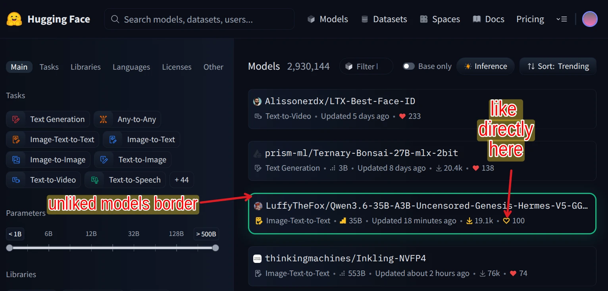

# Hugging Face Unliked Model Highlighter & Date Filter: Client-Side Model Filtering & Visual Highlighter

A clean, high-performance userscript for Hugging Face (`https://huggingface.co/models` and user/organization model lists like `https://huggingface.co/lightx2v/models`) that highlights unliked models with a glowing green border and adds client-side **Date Range Slider filtering**.

## 🚀 Installation

Requires Violentmonkey (or a compatible userscript manager):
- [Firefox](https://addons.mozilla.org/en-US/firefox/addon/violentmonkey/)
- [Chrome / Brave](https://chromewebstore.google.com/detail/violentmonkey/jinjaccalgkegednnccohejagnlnfdag)

### 👉 [**CLICK HERE TO INSTALL USERSCRIPT (v1.7.2)**](https://raw.githubusercontent.com/tazztone/scripts/main/userscripts/huggingface/huggingface-heart.user.js)

---

## ⚡ Features

1. **💚 Unliked Model Highlighter**: Adds a distinct emerald green border (`#10b981`) with soft glow around unliked models in search and listing cards.
2. **❤️ Dynamic Liked State Detection**: Real-time heart detection that updates immediately when you like or unlike models without requiring page reloads.
3. **📅 Date Range Slider Filter**: Restrict models by update age using interactive sliders, numeric min/max day inputs, and quick presets (`24h`, `3d`, `7d`, `14d`, `30d`, `60d`, `90d`, `180d`, `1y`, `All`).
4. **📊 Unified Sidebar Widget**: Injects a native-styled filter widget into the left sidebar showing exact date range labels, live model counters (`Showing X / Y models`), and expandable **Highlighter Options** (color picker, glow toggle, highlight switch).
5. **⚡ Performance Optimized**: MutationObserver feedback shielding and debounced storage IO for zero lag during slider dragging and infinite scroll.

---

## 🚀 Instant Auto-Installer Tool & Auto-Updates

### 1. Direct Install Link
Install directly via your userscript manager using the raw GitHub link above.

### 2. Automatic Background Updates (`@updateURL`)
The script includes embedded `@updateURL` and `@downloadURL` metadata headers. Violentmonkey, Tampermonkey, and ScriptCat will check GitHub automatically in the background and keep your installed userscript updated without requiring manual reinstalls.

---

## ⚙️ Configuration & Persistence

You can customize both date filtering and highlighter options directly inside the left sidebar widget under **Highlighter Options**:

| Key | Default Value | Description |
| :--- | :--- | :--- |
| `BORDER_UNLIKED_ENABLED` | `true` | Enable green border highlighting around unliked models. |
| `BORDER_UNLIKED_COLOR` | `'#10b981'` | Border color for unliked model cards. |
| `BORDER_UNLIKED_GLOW` | `true` | Enable soft box-shadow glow around unliked model cards. |
| `DATE_FILTER_ENABLED` | `false` | Enable client-side date range filtering. |
| `DATE_MIN_DAYS` | `0` | Minimum update age in days (0 = Today). |
| `DATE_MAX_DAYS` | `30` | Maximum update age in days. |
| `DATE_PRESET` | `'all'` | Selected quick preset (`24h`, `3d`, `7d`, `14d`, `30d`, `60d`, `90d`, `180d`, `1y`, `all`). |

> [!NOTE]
> All settings and configuration options are saved **permanently** via `GM_setValue` / `GM_getValue` in userscript storage and persist indefinitely across browser sessions and site reloads.
