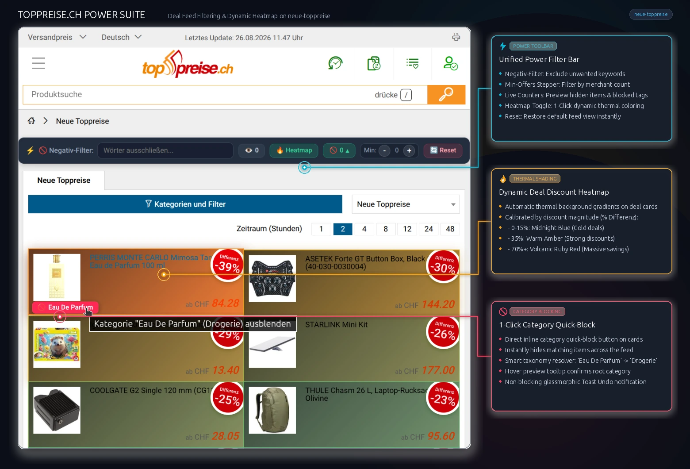

# Toppreise.ch Suite: Power Filter & Price Alarm Auto-Filler

All-in-one userscript for Toppreise.ch that highlights best price offers, verifies authentic all-time Tiefstpreise (Real Deals) vs fake discounts, excludes unwanted negative keywords, provides 1-click inline category blocking with overview chips, sorts/filters by offer count, renders dynamic deal discount heatmaps, and automates price alarm creation.



## 🚀 Installation

Requires Violentmonkey (or a compatible userscript manager):
- [Firefox](https://addons.mozilla.org/en-US/firefox/addon/violentmonkey/)
- [Chrome / Brave](https://chromewebstore.google.com/detail/violentmonkey/jinjaccalgkegednnccohejagnlnfdag)

### 👉 [**CLICK HERE TO INSTALL USERSCRIPT (v2.17.6)**](https://raw.githubusercontent.com/tazztone/scripts/main/userscripts/toppreise/toppreise.user.js)

---

## ⚡ Features

1. **💎 Neue Bestpreise: Kuratierter Bestpreis-Feed mit Continuous Deal-Score & Statistischem Filter (v2.17.6)**:
   - **1-Klick-Feed-Modus (`[ 💎 Neue Bestpreise ]`)**: Verwandelt `/neue-toppreise` per Knopfdruck in einen echten Bestpreis-Feed. Filtert Schein-Rabatte und unvollständige Daten automatisch aus und sortiert alle Angebote nach echter Deal-Qualität.
   - **🔥 Continuous Deal-Score & Thermal Heatmap**: Berechnet für jedes verifizierte Angebot einen gewichteten Deal-Score aus Median-Rabatt ($D_{\text{median}}$) und Allzeit-Rekordmarge ($D_{\text{record}}$). Die Heatmap färbt die Karten direkt anhand dieses echten Scores (kühles Cyan $\rightarrow$ warmes Bernstein $\rightarrow$ feuriges Rubinrot).
   - **📅 Rollierender Median-Zeithorizont (1 Jahr, 6M, 3M, Lifetime)**: Verhindert verzerrte Durchschnittspreise bei älteren Produkten (z. B. 2–3 Jahre alte Grafikkarten/Fernseher mit hohem Launch-UVP). In den Einstellungen kann der Vergleichszeitraum für den Marktpreis frei gewählt werden (Standard: 1 Jahr / 365 Tage).
   - **🛡️ Multi-Pass Preisfehler- & Ausreisser-Filter**: Erkennt und ignoriert automatisch kurzzeitige Händler-Fehllistings (z. B. ein CHF 15 Handy-Case, das versehentlich unter einem CHF 1'200 Smartphone gelistet war), sodass echte Allzeit-Tiefstpreise nicht fälschlicherweise blockiert werden.
   - **🏷️ Real Deal Badge & Sublines**: Das Kreisbadge zeigt `-Score%` mit aufgeräumtem 2-Zeilen-Layout (`Real Deal`). Die Subline unter dem Preis liefert glasklare Transparenz (`Bisher: CHF 2'399.00 (-21%)` bei neuen Rekorden bzw. `Ø-Preis (1J): CHF 2'450.00 (-28%)` bei Allzeit-Tiefstpreisen).
   - **⚖️ Konfigurierbare Gewichtung**: Im Einstellungsmenü kann das Verhältnis zwischen Alltags-Ersparnis (Median) und Rekord-Tiefstpreis per Slider stufenlos angepasst werden (Standard: 50% / 50%).
   - **Non-Destructive Auto-Scan & Grid-Safe Sorting**: Ungeprüfte Produkte bleiben während des Paced Scans mit dezentem `⏳ Prüfe...`-Spinner sichtbar und sortieren sich live ein, ohne das Bootstrap-Grid zu beschädigen. Beim Deaktivieren wird die ursprüngliche Feed-Reihenfolge 100% sauber wiederhergestellt.
2. **🌟 Integrierte Real Deals & Allzeit-Tiefstpreis Prüfung**: Verifiziert echte Rekord-Preise direkt im bestehenden Toppreise Differenz-Kreisbadge (`.badge-dif`) ohne störende Extra-Badges.
   - **1-Klick-Check im Differenz-Badge (`🔍`)**: Das Rabatt-Kreisbadge besitzt eine dezente Eck-Lupe und löst per Klick direkt die historische Tiefstpreis-Prüfung aus.
   - **`🌟 Allzeit-Tiefstpreis` & Neuer Rekord-Tiefstpreis**: Echte Rekordpreise erhalten einen leuchtend grünen Halo-Ring um das Differenz-Badge. Bei neuen Allzeit-Tiefstpreisen wird zusätzlich der bisherige Tiefstpreis und der echte Neuer-Rekord-Rabatt angezeigt (`Bisher: CHF 1'978.15 (-38%)`).
   - **`⚠️ +XX%` Aufschlag-Morph & Gestrichener Schein-Rabatt (`~~-YY%~~`)**: Entlarvt Schein-Rabatte direkt im Kreisbadge mit auffälligem `+XX%` Aufschlag und durchgestrichenem Feed-Rabatt `<s>-YY%</s>`, plus `Tiefstpreis: CHF XX.XX` unter dem Preis.
   - **Filterleisten-Toggle (`🌟 Nur Tiefstpreise`)**: Blendet verifizierte Nicht-Bestpreise auf Knopfdruck aus.
   - **Batch-Checker mit Live-Zähler (`🔍 Check Deals (N)`)**: Prüft auf Knopfdruck nacheinander alle Deals ab dem Schwellenwert mit Live-Fortschrittszähler und Abbruch-Option.
   - **Schwellenwert-Schnellwahl (`≥30% ▾`)**: Direkte Auswahl des Mindestrabatts (20%, 30%, 40%, 50%, 60%) in der Filterleiste mit sofortiger Live-Aktualisierung des Zählers.
   - **Selektive Heatmap**: Der thermische Heatmap-Effekt bleibt nur bei echten Tiefstpreisen aktiv und wird bei Schein-Rabatten automatisch entfernt.
   - **Detailseiten-Badge (`/preisvergleich/...-p...`)**: Zeigt direkt auf Produktseiten neben dem Haupttitel/Hauptpreis, ob das Angebot ein Allzeit-Tiefstpreis ist.
   - **Leere-Feed-Hinweis (Empty State)**: Blendet bei komplett gefilterter Seite einen eleganten Hinweis mit Schnellaktionen ein (`[ 👁️ Vorschau ]`, `[ 💎 Bestpreise aus ]`, `[ 🌟 Filter aus ]`, `[ 🔄 Reset ]`).
   - **Konfigurierbarer Cache & 1-Klick Wipe**: Einmal geprüfte Produkte bleiben im Browser gespeichert (Dauer frei wählbar: 24h, 48h [Standard], 72h, 7 Tage, 14 Tage) und laden bei Folgebesuchen blitzschnell ohne Netzwerkabfrage. Nicht verfügbare Produkte werden zwischengespeichert (1h–24h). Im Einstellungsmenü gibt es eine Live-Anzeige der gespeicherten Einträge und einen `🗑️ Cache leeren`-Button.
3. **📈 Mini Preis-Trend Sparklines (Beta)**: Zeigt auf Karten mit geprüfter Preishistorie kompakte Inline-SVG-Sparklines des historischen Preisverlaufs (Grün für fallenden Trend / Allzeit-Tief 🟢, Rot für steigenden Trend 🔴) mit Hover-Skalierung und Tooltip (optional in den Einstellungen aktivierbar). Lädt blitzschnell in einem einzigen Request ohne zusätzliche Server-Abfragen.
4. **🔥 Rabatt-Heatmap (100% Heiß bis 0% Kalt)**: Dynamische thermische Hintergrund-Verläufe auf allen Produktkarten anhand der Rabatthöhe (z. B. auf `neue-toppreise`). Realistische Deal-Kalibrierung: 0–15% Kaltes Mitternachtsblau ❄️ $\rightarrow$ 35% Warmes Bernstein ⚡ $\rightarrow$ 70%+ Vulkanisches Rubinrot 🔥 mit leuchtenden Akzenten. 1-Klick-Toggle direkt in der oberen Filterleiste.
5. **🚫 1-Click Product Card Category Quick-Block & Toast Undo**: Direct "🚫 [Kategorie]" action button overlay on every product card on `neue-toppreise`. Clicking instantly hides the product's category from the feed and displays a glassmorphic toast notification with a **"Rückgängig"** (Undo) action button.
6. **📋 Blocked Categories Overview Chips**: Top filter bar shows a compact overview row `🚫 Ausgeblendet (N)` with dismissable chips (`[ 💻 Externe SSD ✕ ]`, `[ 🧸 Lego ✕ ]`) and an *Alle freigeben* button whenever categories are blocked.
7. **📁 Intelligent Category Taxonomy Resolution**: Multi-level resolution algorithm with card URL path parsing (`/preisvergleich/<RootSlug>/...`), domain brand rules (*Lego*, *Playmobil*, *Cobi*, *Schleich*, *Barbie*, *Hot Wheels*, *CaDA*, *Amiibo* $\rightarrow$ 🧸 **Spielwaren** / 🎮 **Videogames**), and keyword fallback routing.
8. **🛡️ Encapsulated Shadow DOM Settings Modal (`#tp-root`)**: Floating action button (FAB) and settings dialog are isolated inside an open Shadow Root, elevated to the browser Top Layer via native `<dialog>` (`showModal()`) to bypass host site z-index and CSS reset collisions.
9. **⌨️ Tastatur-Shortcuts**:
   - `/`: Sofortiger Fokus und Textauswahl im Negativ-Filter (wird bei aktiven Formularfeldern ignoriert).
   - `Escape`: Entfernt den Fokus aus dem Negativ-Filter bzw. schließt das Einstellungsmenü.
10. **📥 / 📤 JSON Konfigurations-Import & Export**: Vollständiges Sichern und Wiederherstellen aller Einstellungen (Ausschlussbegriffe, Kategorien-Blacklists, Schwellenwerte) per JSON-Datei mit Whitelist-Validierung.
11. **Händler Bestpreis Highlights**: Highlights products with an emerald green border & "Best Price" badge when a filtered store is the cheapest (or within custom margin %), while dimming/hiding non-cheapest products.
12. **Negativer Textfilter (Ausschluss)**: Exclude products containing specific unwanted keywords (e.g. `SAMSUNG, Hülle, Case, Refurbished, Gebraucht`) with word-boundary precision via the inline search bar or modal.
13. **Angebote & Rabatt-Sortierung**: Filter out marketplace items with fewer than $N$ offers, plus optional client-side re-sorting by total offer count or highest discount (`% Rabatt ⬇`).
14. **Preisalarm Auto-Filler**: Automatically configures target price (e.g. 60% of current price) and 2-year duration upon clicking the price alarm bell icon, supporting Swiss currency formatting (`CHF 1'299.–`).
15. **⚡ Context-Aware Top Filter Bar**: Consolidated toolbar that automatically adapts to the page context:
    - **Deal Feeds (`/neue-toppreise`)**: Full suite with hidden count indicator `👁️ N`, `💎 Neue Bestpreise` toggle, `🔥 Heatmap` toggle, `🌟 Nur Tiefstpreise` toggle, `🔍 Check Deals (N)` batch button with threshold quick-selector `≥30% ▾`, Min-Offers stepper `[-] 0 [+]`, and `🔄 Reset`.
    - **Catalog / Search Listings (`/produktsuche/...`)**: Streamlined toolbar displaying `⚡ 🚫 Negativ-Filter`, `👁️ N` reveal preview, `[-] Min N [+]` stepper, blocked category overview, and `🔄 Reset` (hiding deal-feed-only buttons).
    - **Product Detail Pages (`/preisvergleich/...-p...`)**: Filter bar is cleanly suppressed so single-product pages remain uncluttered.

---

## 🚀 Automatic Updates (`@updateURL`)

The script includes embedded `@updateURL` and `@downloadURL` metadata headers. Violentmonkey and Tampermonkey will check GitHub automatically in the background and keep your installed userscript updated without requiring manual reinstalls.

---

## ⚙️ Configuration & Persistence

Click the floating **gear button** in the bottom corner of Toppreise.ch to open the glassmorphic settings panel:

- **💎 Neue Bestpreise Modus**: Auto-Scan + Tier-Ranking auf der Deal-Feed-Seite.
- **Händler Bestpreis**: Mode (`'dim'`, `'hide'`, `'highlight-only'`), margin %, opacity, shipping toggle.
- **Rabatt-Heatmap**: Toggle on/off, intensity slider (20% – 100%).
- **Negativer Textfilter**: Comma-separated list of keywords to hide.
- **Angebote & Sortierung**: Set threshold for minimum dealer offers and sort order (`Meiste ⬇`, `Wenigste ⬆`, `% Rabatt ⬇`).
- **Preisalarm Auto-Filler**: Target price percentage slider (default 60%), duration (default 2 years), auto-submit toggle.
- **Import / Export**: 1-Klick JSON Export / Import zur Übertragung von Einstellungen auf andere Browser und Geräte.

> [!NOTE]
> All settings, excluded categories, and negative terms are saved **permanently** with a 2-layer storage architecture (`GM_setValue` / `GM_getValue` with domain `localStorage` auto-healing backup) that survives userscript reinstalls.

---

## 🧪 Development Checks

```bash
node --check userscripts/toppreise/toppreise.user.js
pytest userscripts/toppreise/tests
```
