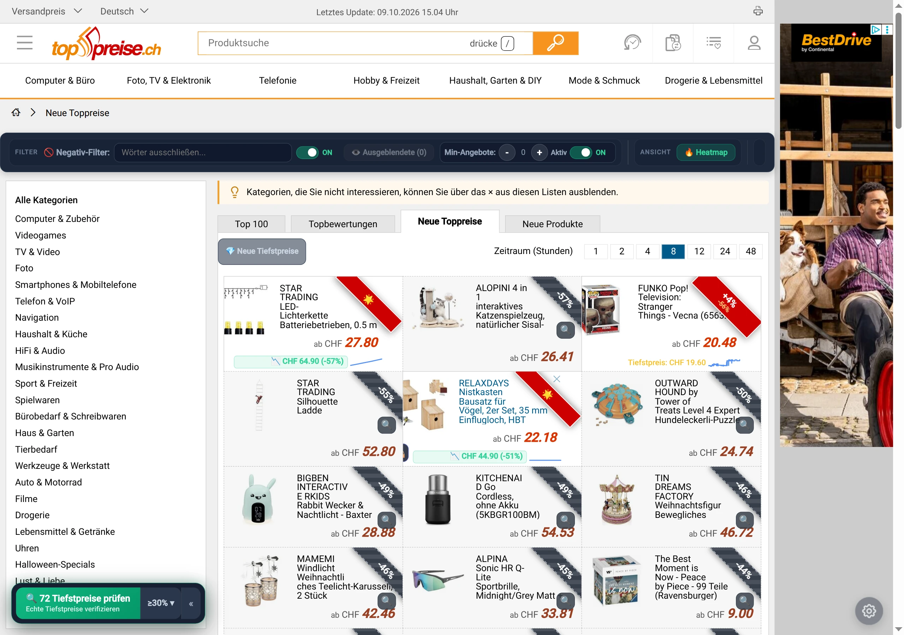

# Toppreise.ch Suite: Power Filter & Price Alarm Auto-Filler

All-in-one userscript for Toppreise.ch that highlights best price offers, verifies authentic all-time Tiefstpreise (Real Deals) vs fake discounts, excludes unwanted negative keywords, sorts/filters by offer count, renders dynamic deal discount heatmaps, and automates price alarm creation. Category blocking is left to Toppreise's native server-side exclusions (`Plugin_IgnoredCategories`: per-card menu, sidebar, top bar).



## 🚀 Installation

Requires Violentmonkey (or a compatible userscript manager):
- [Firefox](https://addons.mozilla.org/en-US/firefox/addon/violentmonkey/)
- [Chrome / Brave](https://chromewebstore.google.com/detail/violentmonkey/jinjaccalgkegednnccohejagnlnfdag)

### 👉 [**CLICK HERE TO INSTALL USERSCRIPT (v2.18.67)**](https://raw.githubusercontent.com/tazztone/userscripts/main/toppreise/toppreise.user.js)

---

## ⚡ Features

1. **💎 Neue Bestpreise: Kuratierter Bestpreis-Feed mit Continuous Deal-Score & Statistischem Filter (v2.18.67)**:
   - **1-Klick-Feed-Modus (`[ 💎 Neue Bestpreise ]`)**: Verwandelt `/neue-toppreise` per Knopfdruck in einen echten Bestpreis-Feed. Filtert Schein-Rabatte und unvollständige Daten automatisch aus und sortiert alle Angebote nach echter Deal-Qualität.
   - **🔥 Deal-Score Ranking & Badge-Heatmap (gekoppelt)**: Für jedes verifizierte Angebot wird ein gewichteter Deal-Score aus Median-Rabatt ($D_{\text{median}}$) und Allzeit-Rekordmarge ($D_{\text{record}}$) berechnet — **der Score sortiert nur** (Bestpreise-Feed). Das Badge zeigt das **Rekord-Ereignis** (`Real Deal · Rekord -X%` vs Bisher bzw. `Real Deal · Ø-Preis -Y%`), niemals den Score und nach Prüfung niemals die Site-Differenz — und **Karten- wie Badge-Farbe folgen dieser Badge-% auf einer gra→rot-Skala**: Tiefrot = grosser Deal, Grau = kein Rabatt (Aufschläge bleiben grau, `+XX%` steht im Badge). Blasse Farben = ungeprüft (Site-Rabatt).
   - **📅 Rollierender Median-Zeithorizont (1 Jahr, 6M, 3M, Lifetime)**: Verhindert verzerrte Durchschnittspreise bei älteren Produkten (z. B. 2–3 Jahre alte Grafikkarten/Fernseher mit hohem Launch-UVP). In den Einstellungen kann der Vergleichszeitraum für den Marktpreis frei gewählt werden (Standard: 1 Jahr / 365 Tage).
   - **🛡️ Multi-Pass Preisfehler- & Ausreisser-Filter**: Erkennt und ignoriert automatisch kurzzeitige Händler-Fehllistings (z. B. ein CHF 15 Handy-Case, das versehentlich unter einem CHF 1'200 Smartphone gelistet war), sodass echte Allzeit-Tiefstpreise nicht fälschlicherweise blockiert werden.
   - **🏷️ Real Deal Badge & Sublines**: Das Kreisbadge zeigt den echten Rabatt mit Baseline (`Real Deal · Rekord -X%` bei neuem Rekord, `Real Deal · Ø-Preis -Y%` am Tiefstpreis). Die Subline unter dem Preis liefert glasklare Transparenz (`Bisher: CHF 2'399.00 (-21%)` bei neuen Rekorden bzw. `Ø-Preis (1J): CHF 2'450.00 (-28%)` bei Allzeit-Tiefstpreisen). Mini-Rekorde (< 2%) erscheinen als schlichtes `Tiefstpreis 🌟`. Der Tooltip erklärt Badge-Baseline, Ranking-Score und Farb-Bedeutung.
   - **⚖️ Konfigurierbare Sortier-Gewichtung**: Im Einstellungsmenü kann das Ranking-Verhältnis zwischen Alltags-Ersparnis (Median) und Rekord-Tiefstpreis per Slider stufenlos angepasst werden (Standard: 50% / 50%) — betrifft nur die Feed-Sortierung, Farben & Badge-Prozente bleiben unverändert. Ein Rechenbeispiel (`z.B. Rek −10% + Ø −25% → Score 18`) läuft live beim Ziehen mit; die Filterleiste erklärt die Optionen als Ordnung (`Rekord-Jagd`, `Ø-Schnäppchen`).
   - **Non-Destructive Auto-Scan & Grid-Safe Sorting**: Ungeprüfte Produkte bleiben während des Paced Scans mit dezentem `⏳ Prüfe...`-Spinner sichtbar und sortieren sich live ein, ohne das Bootstrap-Grid zu beschädigen. Beim Deaktivieren wird die ursprüngliche Feed-Reihenfolge 100% sauber wiederhergestellt.
2. **🌟 Integrierte Real Deals & Allzeit-Tiefstpreis Prüfung**: Verifiziert echte Rekord-Preise direkt im bestehenden Toppreise Differenz-Kreisbadge (`.badge-dif`) ohne störende Extra-Badges.
   - **1-Klick-Check im Differenz-Badge (`🔍`)**: Das Rabatt-Kreisbadge besitzt eine dezente Eck-Lupe und löst per Klick direkt die historische Tiefstpreis-Prüfung aus.
   - **`🌟 Allzeit-Tiefstpreis` & Neuer Rekord-Tiefstpreis**: Echte Rekordpreise erhalten einen leuchtend grünen Halo-Ring um das Differenz-Badge. Bei neuen Allzeit-Tiefstpreisen wird zusätzlich der bisherige Tiefstpreis und der echte Neuer-Rekord-Rabatt angezeigt (`Bisher: CHF 1'978.15 (-38%)`).
   - **`⚠️ +XX%` Aufschlag-Morph & Gestrichener Schein-Rabatt (`~~-YY%~~`)**: Entlarvt Schein-Rabatte direkt im Kreisbadge mit auffälligem `+XX%` Aufschlag und durchgestrichenem Feed-Rabatt `<s>-YY%</s>`, plus `Tiefstpreis: CHF XX.XX` unter dem Preis.
   - **Konsolidierte Vorschau (`👁️ N`)**: Zeigt die Gesamtzahl aller durch Suite-Filter ausgeblendeten Produkte und ermöglicht per Klick eine Live-Vorschau aller gefilterten Karten mit dezentem Kontur-Highlight. (Native Kategorie-Ausschlüsse verwaltet Toppreise serverseitig in seiner eigenen Leiste.)
   - **Batch-Checker mit Live-Zähler (`🔍 Check Deals (N)`)**: Prüft auf Knopfdruck nacheinander alle Deals ab dem Schwellenwert mit Live-Fortschrittszähler und Abbruch-Option.
   - **Schwellenwert-Schnellwahl (`Site ≥30% ▾`)**: Check-Vorauswahl für den Batch-Scan (20%, 30%, 40%, 50%, 60%): Nur Deals mit mindestens so viel **Site-Rabatt** (ungeprüfte Differenz, z.B. vs UVP) werden automatisch geprüft — die Prüfung ersetzt ihn durch den echten Rabatt.
   - **Selektive, ehrliche Heatmap**: Die Farbe folgt der Badge-% (Rekord-Rabatt) auf einer Grau→Rot-Skala, nicht dem Site-Rabatt. Verifizierte Aufschläge zeigen `+XX%` (Badge) und bleiben grau; ungeprüfte Karten sind bewusst blasser.
   - **Detailseiten-Badge (`/preisvergleich/...-p...`)**: Zeigt direkt auf Produktseiten neben dem Haupttitel/Hauptpreis, ob das Angebot ein Allzeit-Tiefstpreis ist.
   - **Leere-Feed-Hinweis (Empty State)**: Blendet bei komplett gefilterter Seite einen eleganten Hinweis mit Schnellaktionen ein (`[ 👁️ Ausgeblendete anzeigen ]`, `[ 💎 Bestpreise aus ]`, `[ ⚡ Filter ausschalten ]`).
   - **Konfigurierbarer Cache & 1-Klick Wipe**: Einmal geprüfte Produkte bleiben im Browser gespeichert (Dauer frei wählbar: 24h, 48h [Standard], 72h, 7 Tage, 14 Tage) und laden bei Folgebesuchen blitzschnell ohne Netzwerkabfrage. Nicht verfügbare Produkte werden zwischengespeichert (1h–24h). Im Einstellungsmenü gibt es eine Live-Anzeige der gespeicherten Einträge und einen `🗑️ Cache leeren`-Button.
3. **🏷️ Inline Deal Pills & Produktvarianten-Schutz auf Kategorieseiten (`/produktsuche/...`)**:
   - **Kompakte 1-Zeilen Inline Deal Pills (`.tp-deal-pill`)**: Auf Kategorieseiten und in Suchergebnissen werden Deals platzsparend als horizontale 1-Zeilen-Pills direkt über dem Preisblock eingebunden (`[ 🔍 Deal ]`, `[ 🌟 Real Deal -XX% ]`, `[ ⚠️ +XX% ]`). Keine Überlappungen mehr mit Preisen, Angeboten oder Sparklines.
   - **Vollständiger Schutz für Produktvarianten-Serien (`.Plugin_ProductCollItem`)**: Gruppierte Produktfamilien (wie z. B. Apple AirPods 5 mit/ohne Wireless Case) bleiben als geschlossene Einheit erhalten. Die Sortierlogik zieht Varianten niemals auseinander und zerstört nicht das Bootstrap-Layout.
   - **Kompakte Subcards & Titel-Pills**: In Varianten-Subcards (`.f_collection`) wird das Deal-Pill elegant neben dem Variantentitel platziert, während Etiketten wie `🏷️ günstigste Variante` exakt an ihrer nativen Position bleiben.
   - **Verfügbarkeits-Icon Baseline & Randabstand**: Garantiert, dass der grüne Lieferbarkeits-Punkt (`.Plugin_AvailabilityInformation`) vertikal zentriert bleibt und selbst bei langen historischen Preisen und Sparklines niemals am rechten Kartenrand abgeschnitten wird.
   - **Händlerfilter-Kompatibilität**: Verhindert falsches Dimmen von Kategoriemarkt-Karten ohne Händlertabellen, wenn ein spezifischer Händler im Filter ausgewählt ist.
4. **📈 Mini Preis-Trend Sparklines**: Zeigt auf Karten mit geprüfter Preishistorie kompakte Inline-SVG-Sparklines des historischen Preisverlaufs (Grün für fallenden Trend / Allzeit-Tief 🟢, Rot für steigenden Trend 🔴) mit Hover-Skalierung und Tooltip (in den Einstellungen aktivierbar). Lädt blitzschnell in einem einzigen Request ohne zusätzliche Server-Abfragen.
5. **🔥 Continuous Badge-Heatmap (Grau→Rot-Skala)**: Thermische Karten- und Badge-Färbung anhand der angezeigten Badge-%:
   - Grosser Rabatt (z.B. −58%): Tiefes Rubinrot 🔥 (Karte + Badge)
   - Kleiner Rabatt (z.B. −8%): Helles Warmbraun
   - `±5%` und Aufschläge (z.B. +53%): Neutrales Grau ⚖️ (kein Signal; `+XX%` steht im Badge)
   - Ungeprüft (Site-Rabatt): gleiche Skala, aber blasser + 🔍
   - 1-Klick-Toggle (`[ 🔥 Heatmap ]`) direkt in der oberen Filterleiste mit stufenloser Intensitätsregelung.
6. **🛡️ Encapsulated Shadow DOM Settings Modal (`#tp-root`)**: Floating action button (FAB) and settings dialog are isolated inside an open Shadow Root, elevated to the browser Top Layer via native `<dialog>` (`showModal()`) to bypass host site z-index and CSS reset collisions.
7. **⌨️ Tastatur-Shortcuts**:
    - `/`: Sofortiger Fokus und Textauswahl im Negativ-Filter (wird bei aktiven Formularfeldern ignoriert).
    - `Escape`: Schließt das Einstellungsmenü bzw. hebt den Filter-Fokus auf.
8. **📥 / 📤 JSON Konfigurations-Import & Export**: Vollständiges Sichern und Wiederherstellen aller Einstellungen (Begriffsfilter, Schwellenwerte) per JSON-Datei mit Whitelist-Validierung.
9. **Händler Bestpreis Highlights**: Highlights products with an emerald green border & "Best Price" badge when a filtered store is the cheapest (or within custom margin %), while dimming/hiding non-cheapest products.
10. **Negativer Textfilter (Ausschluss)**: Exclude products containing specific unwanted keywords (e.g. `SAMSUNG, Hülle, Case, Refurbished, Gebraucht`) with word-boundary precision directly via the inline top search bar (`🚫 Negativ-Filter`).
11. **Angebote & Rabatt-Sortierung**: Filter out marketplace items with fewer than $N$ offers, plus optional client-side re-sorting by total offer count or highest discount (`% Rabatt ⬇`).
12. **Preisalarm Auto-Filler**: Automatically configures target price (e.g. 60% of current price) and 2-year duration upon clicking the price alarm bell icon, supporting Swiss currency formatting (`CHF 1'299.–`). With Auto-Submit enabled (default), it also ticks the terms checkbox and submits the alarm form on your behalf — disable Auto-Submit in the settings if you prefer to review and submit manually.
13. **⚡ Context-Aware Top Filter Bar**: Consolidated toolbar that automatically adapts to the page context:
    - **Deal Feeds (`/neue-toppreise`)**: Full suite with hidden count indicator `👁️ N`, `💎 Neue Bestpreise` toggle, `🔥 Heatmap` toggle, `🔍 Check Deals (N)` batch button with threshold quick-selector `≥30% ▾`, Min-Offers stepper `[-] 0 [+]`, and per-filter toggles (`📝` Text, `🔢` Min-Angebote, `💎` Deal).
    - **Catalog / Search Listings (`/produktsuche/...`)**: Streamlined toolbar displaying `⚡ 🚫 Negativ-Filter`, `👁️ N` reveal preview, and `[-] Min N [+]` stepper.
    - **Product Detail Pages (`/preisvergleich/...-p...`)**: Filter bar is cleanly suppressed so single-product pages remain uncluttered.

---

## 🚀 Automatic Updates (`@updateURL`)

The script includes embedded `@updateURL` and `@downloadURL` metadata headers. Violentmonkey and Tampermonkey will check GitHub automatically in the background and keep your installed userscript updated without requiring manual reinstalls.

---

## ⚙️ Configuration & Persistence

Klicke auf das schwebende **Zahnrad-Symbol** unten rechts auf Toppreise.ch, um das aufgeräumte Einstellungsmenü zu öffnen (konsolidiert in 5 übersichtliche Bereiche auf einer Seite ohne störende Tabs):

1. **Händler Bestpreis Highlights & Sortierung**: Modus (`'dim'`, `'hide'`, `'highlight-only'`), Preis-Toleranz (%), Deckkraft, Versandkosten-Vergleich und Sortierreihenfolge (`Meiste ⬇`, `Wenigste ⬆`, `% Rabatt ⬇`).
2. **Rabatt-Heatmap & Deals**: Heatmap an/aus (Farbe = Rabatt-Tiefe, Grau→Rot), Intensitäts-Regler (20% – 100%), Sortier-Gewichtung für den Deal-Score (nur Sortierung), Analyse-Zeithorizont (1 Jahr, 6M, 3M, Lifetime) und Check-Vorauswahl (Site-Rabatt) für den Deal-Scanner.
3. **Preisalarm Auto-Filler**: Zielpreis-Prozentsatz (Standard: 60%), Laufzeit (3 Monate bis 2 Jahre), Auto-Submit & konfigurierbare Schließverzögerungen.
4. **Performance, Cache & Preiskurven**: Mini-Preiskurven (Sparklines) an/aus, Cache-Gültigkeit (24h bis 14 Tage), Negativ-Cache (1h bis 24h), Live-Eintragszähler und 1-Klick-Cache-Bereinigung (`🗑️ Cache leeren`).
5. **Backup & Übertragen**: Vollständiger 1-Klick JSON Export / Import zur nahtlosen Übertragung aller Einstellungen und Begriffsfilter auf andere Browser und Geräte.

> [!TIP]
> **Schnellzugriff in der Filterleiste:** Der Negativ-Textfilter (`🚫 Negativ-Filter`) und der Mindest-Angebote-Stepper (`[-] Min N [+]`) befinden sich für maximale Ergonomie direkt in der oberen Schnellfilterleiste und können dort ohne Öffnen des Einstellungsmenüs sofort bedient werden.

> [!NOTE]
> All settings and negative terms are saved **permanently** with a 2-layer storage architecture (`GM_setValue` / `GM_getValue` with domain `localStorage` auto-healing backup) that survives userscript reinstalls.

---

## 🏗️ Architecture & Development

The source code is modularized under `src/`:
- `src/domain/price.js`: Pure price parsing, integer cents conversion, time-series anomaly filtering, and rolling horizon analytics.
- `src/domain/deal-score.js`: Deal classification and weighted continuous scoring algorithms.
- `src/scanner/cache.js`: Bounded in-memory LRU cache (`MAX_MEMORY_CACHE_ITEMS = 500`) with TTL validation and localStorage pruning.
- `src/page/selectors.js`: Central immutable `SELECTORS` registry for feed, catalog, detail, and price containers.
- `src/app.js`: Userscript orchestration, UI components, observers, and DOM lifecycle.

### Build Pipeline & Quality Gates

```bash
# Build the distributable toppreise.user.js artifact from src/
node toppreise/tools/build.js

# Verify bundle integrity and detect drift (CI gate)
node toppreise/tools/build.js --check

# Syntax verification
node --check toppreise/toppreise.user.js
```

### 🧪 Test Execution

```bash
# Fast unit tests (~40ms, zero-browser overhead)
node --test toppreise/tests/unit/*.test.js
# Or via pytest:
venv/bin/pytest toppreise/tests/test_price_logic.py

# Targeted Playwright browser regression test suite (~40s)
venv/bin/pytest toppreise/tests/test_catalog_layout.py
```
