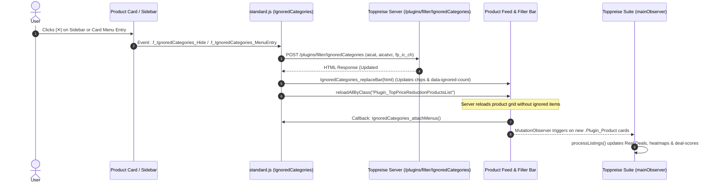

# Toppreise.ch Suite - Research & Selector Reference

This document details the DOM selectors, event management, and filter logic for the unified Toppreise.ch Suite.

## 1. Core Target Elements & Selectors

### Product Listings & Filters
- **Active Store Filter**: `.filters .f_remove_filter[data-target-type="df"]`
- **Product Card Container**: `a.Plugin_Product.medium-box` (feed `/neue-toppreise`), `.Plugin_Product.mixedBrowsingList, .Plugin_Product` (catalog/search)
- **State Marker Classes**:
  - `tp-is-cheapest`: Filtered store has best price (within margin %).
  - `tp-not-cheapest`: Filtered store sells item, but higher price.
  - `tp-no-store-offer`: Filtered store does not sell item.
  - `tp-negative-filtered`: Card hidden by negative keyword filter.
  - `tp-category-filtered`: Card hidden by category exclusion blacklist.
  - `tp-min-offers-filtered`: Card hidden due to fewer offers than `MIN_OFFERS`.
  - `tp-stock-filtered`: Card hidden due to failing delivery availability criteria.

### Price Alarm Automation
- **Modal Container**: `.Plugin_NewInfoMailForm` inside `.AbstractDialog.AbstractDialog_NewInfoMailFormDialog`
- **Present Price**: `.Plugin_NewInfoMailForm .shippingPrice .Plugin_Price`, fallback `.productPrice .Plugin_Price`
- **Target Price Input**: `input#f_NewInfoMailForm_priceFrom` or `input[name="im_nimf_pvf"]`
- **Duration Input**: Hidden input `input[name="im_nimf_du"]` + dropdown `li[data-value="730"]` (2 years)
- **GDPR Terms Checkbox**: `input#im_nimf_prtrm`
- **Submit Button**: `.Plugin_NewInfoMailForm input.f_submitbtn`
- **Dialog Close Button**: `.AbstractDialog_CloseButton`

### Native Category Management Engine
- **Main Bar Container**: `.Plugin_IgnoredCategories` (`#Plugin_IgnoredCategories_*`) with `data-context-hash`, `data-ajax-url="/plugins/filter/IgnoredCategories"`, `data-ignored-count`, `data-active="1"`
- **Bar Chips Wrapper**: `.ignoredCategoriesBar` inside `.Plugin_IgnoredCategories`
- **Empty State Hint**: `.ignoreCategoryHint` ("Kategorien, die Sie nicht interessieren...")
- **Ignored Category Chip**: `.ignoredCategory.f_IgnoredCategories_Show[data-vcat-id][data-ident]`
- **Overflow Toggle**: `.moreChipsToggle.f_IgnoredCategories_MoreChips[data-more-template="+{1}"][data-less="weniger"]`
- **Reset All Trigger**: `.resetAll.f_IgnoredCategories_Reset[data-ident]` ("Alle einblenden")
- **Reset Modal Dialog**: `.AbstractDialog.AbstractDialog_IgnoredCategoriesResetDialog` with `.f_IgnoredCategories_ResetConfirm`
- **Left Sidebar Selector**: `.Plugin_CategoryMainSelectionLeft.submenuList` (`#Plugin_CategoryMainSelectionLeft_*`) with `data-trgt="TopPriceReductionProductListFull"`
- **Sidebar Category Cross Button**: `span.ignoreCategory.f_IgnoredCategories_Hide[data-vcat-id][data-ident]`
- **Sidebar Category List Entry**: `li.category_level_0` (gets `.ignoredCategoryEntry` when excluded)
- **Sidebar Expand/Collapse Toggles**: `.f_showMoreCatDetails.showClosedOnly` / `.f_hideMoreCatDetails.showExpandedOnly`
- **Per-Card Hover Menu Trigger**: `.hideCategoryTrigger.f_IgnoredCategories_MenuTrigger` (adds `.hasHideTrigger` to `.Plugin_Product`)
- **Card Context Flyout Menu**: `.IgnoredCategoriesMenu` with `.entry.f_IgnoredCategories_MenuEntry[data-vcat-id][data-ident]`
- **Full-Page Empty State**: `.emptyBecauseIgnored` with `.hint` and `.resetAll`

---

## 2. UI Encapsulation & Shadow DOM Architecture

- **Root Container**: `<div id="tp-root">` attached to `document.body` with an open Shadow Root.
- **Top Layer Dialog**: `<dialog id="tp-settings-dialog">` renders inside the Top Layer via `showModal()`, bypassing host site stacking contexts and `z-index` collisions.
- **Dual-Layer Style Separation**:
  - Host document styles (`.Plugin_Product.mixedBrowsingList.tp-is-cheapest`, `.tp-negative-filtered`, `#tp-suite-filter-bar`, `#tp-quick-toolbar`) live in a host `<style>` tag.
  - Settings dialog and FAB styles live strictly inside the `#tp-root` Shadow Root (`SHADOW_MODAL_STYLES`).
- **Toasts**: Non-blocking toast notifications render inside `#tp-toast-container` within the shadow root.

---

## 3. Fast Synchronous & Idempotent DOM Processing

- `processListings()` processes product cards synchronously with idempotent guards (`setHtmlIfChanged`, `setTextIfChanged`, cached heatmap styles, and in-place DOM order checks) to eliminate forced reflows and layout thrashing.
- Extracted metadata is cached on `card.dataset.tpCategory`, `card.dataset.tpOfferCount`, and `card.dataset.tpAppliedHeat` to avoid repeated parsing during DOM mutations.
- Network scans (`runProductScanner`) pace asynchronous requests with jittered delays (200–350ms) to protect the main UI thread and prevent site rate limits.

---

## 4. Reinstall-Proof 2-Layer Storage Architecture (v2.3.0)

- **Layer 1 (Extension Sandbox)**: `GM_setValue` / `GM_getValue` stores user settings inside Violentmonkey / Tampermonkey storage partition.
- **Layer 2 (Domain Storage Backup)**: `window.localStorage.setItem('tp_suite_v2_' + key, JSON.stringify(val))` stores a mirrored backup directly inside `toppreise.ch` domain storage.
- **Auto-Healing Recovery**: If `GM_getValue` returns `undefined` (e.g. after a clean script uninstall/reinstall), `_getValue` reads `tp_suite_v2_[key]` from `localStorage` and automatically re-seeds `GM_setValue` so settings are preserved indefinitely across script re-installations.

---

## 5. Architectural Gotchas & Session Roadblocks

1. **Card Elements as Anchor Tags (`<a class="Plugin_Product">`)**:
   - *Gotcha*: On `neue-toppreise`, cards are `<a>` tags itself. Calling `card.querySelectorAll('a')` returns `0` elements because `querySelectorAll` only matches descendant children.
   - *Rule*: Always inspect `card.tagName === 'A'`, `card.closest('a[href]')`, and `card.querySelectorAll('a[href]')`.

2. **Absolute Positioned Icons vs Variable Emoji Width**:
   - *Gotcha*: `position: absolute; left: 10px` icons inside text inputs cause text overlap because emoji width varies across operating systems and browser fonts.
   - *Rule*: Prefer flexbox layout with inline label elements (`<span class="tp-input-label-inline">`) positioned *outside* the `<input>` box.

3. **Extension Storage Wipe on Reinstall**:
   - *Gotcha*: Tampermonkey/Violentmonkey purges `GM_getValue` data when a script is uninstalled or reinstalled clean.
   - *Rule*: Dual-sync state to `window.localStorage` on the target web domain (`toppreise.ch`). Domain `localStorage` is persistent across extension script uninstalls.

4. **Flat Pill Overflow at Scale**:
   - *Gotcha*: Rendering 55+ raw subcategory pills creates visual clutter and high cognitive load.
   - *Rule*: Map subcategories into high-level root groups (`Filme`, `Spielwaren`, `Computer & Zubehör`) with collapsible accordion pills.

5. **Transparent Overlays Blocking Page Clicks**:
   - *Gotcha*: Full-screen wrapper containers (`position: fixed; inset: 0`) without `pointer-events: none` capture pointer events across the viewport, preventing users from clicking underlying page elements.
   - *Rule*: Always set `pointer-events: none;` on fixed root wrappers/overlays, and explicitly set `pointer-events: auto;` only on interactive child elements (modals, toolbars, buttons).

6. **MutationObserver Infinite Re-render Pulsing Loop**:
   - *Gotcha*: Un-guarded DOM mutations inside a `MutationObserver` callback trigger the observer again, causing infinite re-render loops where UI elements flicker and pulse continuously.
   - *Rule*: Always guard DOM manipulations with element ID checks (`if (document.getElementById('tp-suite-filter-bar')) return;`) or `dataset.processed` flags to ensure idempotency and prevent self-observation loops.

8. **Top-Layer Dialog Popover Z-Index & Backdrop Trap**:
   - *Gotcha*: When a `<dialog popover="auto">` is open in the browser Top Layer (Shadow DOM), child popovers appended to `document.body` render in the standard document layer behind the modal backdrop and are unclickable or invisible.
   - *Rule*: Pass `mountContainer` to popover controllers and mount popovers directly inside the dialog element when open inside a Top-Layer modal.

9. **Event Interception on Anchor Product Cards**:
   - *Gotcha*: Action buttons (like 1-click quick-block) injected onto `<a class="Plugin_Product">` cards will navigate the browser to the product URL if the click event bubbles.
   - *Rule*: Always invoke `e.preventDefault()`, `e.stopPropagation()`, and `e.stopImmediatePropagation()` inside card action button handlers.

10. **Storage I/O Micro-Optimization during Batch DOM Processing**:
    - *Gotcha*: Writing dynamic category mappings to `GM_setValue` / `localStorage` per card during DOM loops causes repeated synchronous I/O.
    - *Rule*: Buffer updates in an in-memory map during the chunked batch run and flush with `flushDynamicMap()` once at the end of `processListings()`.

11. **Scoped Feed Action Buttons (Neue Toppreise Only)**:
    - *Gotcha*: Quick-block category buttons on search result pages or specific category catalog pages clutter targeted user browsing where category-blocking is unnecessary.
    - *Rule*: Restrict `.tp-card-quick-block` strictly to Neue Toppreise feed pages (`isNeueToppreisePage()`), and actively clean up lingering buttons on regular catalog/search listings.

12. **Safe Placement Anchor (Avoid `.f_filter_plugin` and Site Header)**:
    - *Gotcha*: Anchoring the filter bar inside `.f_filter_plugin` or `.filters` caused Toppreise's native `standard.js` AJAX replacement and jQuery event capture to intercept clicks and wipe the bar on filter changes. Anchoring inside the site header placed it beneath backdrop overlays.
    - *Rule*: Always mount `#tp-suite-filter-bar` as a direct child of `#FrameContent` / `.pageContent` directly preceding the primary product browsing container (`#Page_List...`, `#Page_Browsing`, `.f_browsingListContainer`, `#Plugin_MixedBrowsingList`), and strictly verify `parentElement` is not an unsafe container.

13. **Price Alarm Auto-Submit AJAX Lifecycle & Dialog Teardown**:
    - *Gotcha*: Synchronously clicking `.AbstractDialog_CloseButton` immediately after `input.f_submitbtn.click()` tears down the modal container (`AbstractDialog_hide()`) while Toppreise's AJAX POST request to `/plugins/infomails/NewInfoMailForm` is still in-flight, causing the request to abort and raising *"Es ist ein unerwarteter Fehler aufgetreten. Bitte versuchen Sie es noch einmal."* Furthermore, submitting in 0ms raced with Toppreise's internal duration dropdown and input validator event binding.
    - *Rule*: Always stage auto-submit asynchronously with a 300ms pre-submit settle delay and an 800ms post-submit grace period before closing the modal dialog container.

14. **Deal-Feed-Only Features on Non-Feed Pages**:
    - *Gotcha*: Heatmap, batch deal-check, Tiefstpreis toggle, and threshold selector are rendered on category/search pages where no discount badges (`.badge-dif`) exist, creating dead UI clutter with permanently-zero counters. Furthermore, when `cards.length === 0` on product detail pages (`/preisvergleich/...-pNNNNN`), the filter bar was inadvertently injected above the dealer table.

15. **Pricechart HTML Grid Structure vs `Element.closest()` Traversal**:
    - *Gotcha*: On real Toppreise pricechart endpoints, title headings carry grid classes directly (`<div class="title col-12">Tiefstpreis</div>`). Calling `found.closest('.col-12, .col-4, ...')` evaluates `closest()` on the element itself, matching `.col-12` and returning the title `<div>` (which contains only text, no price).
    - *Rule*: Always inspect adjacent element containers (`found.nextElementSibling?.querySelector('.Plugin_Price')`) or scope parent traversal to `.col-4, .col-md-3, .col-md, [class*="col-"]:not(.title)` and include regex fallbacks.

16. **Deeply Nested Product Feed in `tabContent` (`.f_tab.selected .tabContent`)**:
    - *Gotcha*: On `/neue-toppreise`, `Plugin_TopPriceReductionProductListFull` is no longer a top-level sibling in `contentBox`, but deeply nested inside `.tabbedContainer > .contentBox > .f_tab.selected > .tabContent`. Furthermore, the `.tabContent` element has inline responsive classes `d-md-none d-lg-none d-xl-none d-xxl-none`, which appear hidden unless Toppreise's CSS rule `.tabbedContainer .f_tab.selected .tabContent { display: block !important; }` is active.
    - *Rule*: Never assume the product list container is an immediate child of the main column `contentBox`. Rely on container query selectors (`#Plugin_TopPriceReductionProductListFull_*`, `.Plugin_TopPriceReductionProductListFull`, `.standardList`) or traverse upward to the lowest common parent container.

17. **Product Card Image Wrapper (`.product-image` vs `.image_container`)**:
    - *Gotcha*: Real cards on `/neue-toppreise` wrap images in `<div class="product-image">` inside `<div class="col-auto">`. Prior CSS targeting only `.image_container` failed to constrain real images on production, causing occasional layout stretching.
    - *Rule*: Always style both `.product-image img` and `.image_container img` (along with generic `.Plugin_Product.medium-box img`) to ensure robust image size constraint (max 75x75px, object-fit: contain).

18. **Native Ignored Categories Plugin (`Plugin_IgnoredCategories`) & Sidebar Selection (`Plugin_CategoryMainSelectionLeft`)**:
    - *Gotcha*: Toppreise introduced its own native category exclusion feature across three interconnected UI surfaces: (1) a chip bar `#Plugin_IgnoredCategories_*` at the top of the main content column, (2) category exclusion buttons `.f_IgnoredCategories_Hide` inside the left sidebar `#Plugin_CategoryMainSelectionLeft_*`, and (3) dynamic hover menu triggers `.hideCategoryTrigger.f_IgnoredCategories_MenuTrigger` placed at `top: 0; right: 0; z-index: 3` on every product card.
    - *Rule*:
      1. *Placement Separation*: Mount the Suite filter bar (`#tp-suite-filter-bar`) outside the main column as a direct child of `#FrameContent` before `#Page_ListTopPriceReductionProducts`, ensuring zero DOM collisions with `#Plugin_IgnoredCategories_*`.
      2. *Card UI Harmony*: Position Suite card quick-block buttons (`.tp-card-quick-block`) strictly at the bottom-left (`bottom: 6px; left: 8px`), and Suite discount circle badges at `top: 10px; right: 10px`, completely avoiding the native cross button at `top: 0; right: 0;` and preventing click/hover interference.
      3. *AJAX Refresh Resilience*: When users toggle categories natively, Toppreise fires an AJAX POST to `/plugins/filter/IgnoredCategories` and reloads `Plugin_TopPriceReductionProductListFull`. The Suite's `mainObserver` must passively capture the reloaded product grid and execute `processListings()` without race conditions or re-render loops.

19. **Timeframe Filter AJAX Reloads (`Plugin_TimePeriod`)**:
    - *Gotcha*: Timeframe switches (1h, 2h, 4h, 8h, 12h, 24h, 48h) are managed by `.Plugin_TimePeriod.f_Plugin_Filter_TimePeriod.f_filter_plugin` using hidden radio inputs. When the timeframe changes, Toppreise issues an AJAX request replacing `Plugin_TopPriceReductionProductListFull`.
    - *Rule*: Because the suite filter bar is anchored at `#FrameContent` before `#Page_ListTopPriceReductionProducts`, it is immune to timeframe AJAX wiping. The suite's `MutationObserver` then seamlessly catches the new product cards and runs `processListings()`.

20. **Discount Bracket Consolidation (`m_51_100`)**:
    - *Gotcha*: Toppreise replaced legacy separate brackets `m_51_75` and `m_76_100` with a unified `m_51_100` class on `.badge.badge-dif`.
    - *Rule*: Ensure all bracket-matching selectors and test fixtures include `m_51_100` alongside `m_1_25` and `m_26_50`.

21. **Filter Bar Stale Closure on Dynamic Counts (`uncheckedDeals`)**:
    - *Gotcha*: When the suite filter bar is created on initial page load, `counts.uncheckedDeals` may be `0` before card parsing finishes. If event handlers attached inside `if (!bar)` close over `uncheckedDeals` lexically, subsequent clicks on the button (e.g. `🔍 Check Deals (10)`) read the stale `0` count from the initial closure, showing "Keine ungeprüften Deals vorhanden" instead of scanning.
    - *Rule*: Store dynamic UI counts in DOM element dataset properties (`batchBtn.dataset.uncheckedCount = String(uncheckedDeals)`) on every update pass, and read from `dataset` (or inspect live DOM cards) inside event listeners rather than relying on lexical scoping.

---

## 6. Comprehensive Category Taxonomy & Resolution Engine (v2.8.12)

### 1. Site Taxonomy Structure & URL Patterns
`Toppreise.ch` structures its catalog under **23 primary root category slugs** (mapped into 14–17 canonical display groups such as *Spielwaren*, *Computer & Zubehör*, *Haushalt & Küche*, *Drogerie*, *HiFi & Audio*, etc.).

Subcategories appear in two distinct patterns across the site:
- **Navigation Category Links (`/produktsuche/<Root>/<Subcat>-cNNN`)**: High-level and mid-level category nodes (e.g. `Spielwaren/Bau-Konstruktionsspielzeug-c2404`).
- **Product URL Category Paths (`/preisvergleich/<SubcatSlug>/<ProductTitle>-pNNN`)**: Leaf subcategories (e.g. `Lego-City`, `Heissluftfritteusen`, `Vollautomaten`, `USB-SpeicherSticks`, `AV-Receiver`) appear as the first path segment in product links. These leaf nodes are pagination-dependent (`?p=1..10`).

### 2. Crawl Tool & Yield (`tools/generate_category_map.py`)
- **Automated Depth & Pagination Crawler**: Crawls `/produktsuche/` pages and follows subcategory links up to depth 5, including paginated product lists (`?p=1..10`).
- **Crawl Metrics**: 1,194 pages crawled $\rightarrow$ **669 site subcategories** $\rightarrow$ **1,360 normalized lookup keys** (handling exact titles, URL slugs, space-separated forms, and German umlaut variants `ue` $\leftrightarrow$ `ü`, `ae` $\leftrightarrow$ `ä`, `oe` $\leftrightarrow$ `ö`).
- **Auto-Injection**: Injects `const CATEGORY_LOOKUP` into `toppreise.user.js`.

### 3. 6-Layer Category Resolution Pipeline (`resolveCategoryPath`)
1. **Layer 1: On-Card Product URL Root Slug Extraction**: Reads `/preisvergleich/<RootSlug>/...` or `/produktsuche/<RootSlug>/...` directly from card links (**100% authoritative**).
2. **Layer 2: Site-Crawled `CATEGORY_LOOKUP`**: Matches 1,360 auto-generated lookup keys.
3. **Layer 3: Dynamic Storage `DYNAMIC_CAT_MAP`**: Saved in `GM_setValue` / `localStorage` to learn categories at runtime as user browses.
4. **Layer 4: Brand & Keyword Rules (`BRAND_RULES`)**: Domain regex matching for brands (*CaDA*, *Playmobil*, *Cobi*, *Schleich*, etc.).
5. **Layer 5: Word-Prefix Token Fallback**: Right-to-left word trimming (`Lego Star Wars` $\rightarrow$ `Lego` $\rightarrow$ `Spielwaren`).
6. **Layer 6: DOM Breadcrumbs**: Fallback to page `.breadcrumb` links.

---

## 7. Discount Heatmap Engine & Thermal Scaling (v2.10.0)

### 1. Target Selectors & Data Extraction
- **Discount Badge**: `.badge.badge-dif, .badge` with difference bracket classes (`m_1_25`, `m_26_50`, and consolidated `m_51_100`, previously `m_51_75`, `m_76_100`).
- **Inner Markup**: `<div class="text">Differenz</div> <p>-XX%</p>`.
- **Extraction Function**: `extractCardDiscount(card)` caches parsed percentage ($0 \le D \le 100$) onto `card.dataset.tpDiscount`.

### 2. Thermal Color Keypoints & Interpolation
- **5 High-Saturation Anchor Stops**:
  - `0% – 10%` (Vibrant Cobalt/Ice Blue): Base `[18, 48, 88]`, Accent `[28, 92, 175]`, Border `[56, 140, 248, 0.70]`
  - `15% – 20%` (Vibrant Cyan/Teal): Base `[12, 58, 64]`, Accent `[16, 130, 125]`, Border `[20, 210, 190, 0.75]`
  - `28% – 35%` (Warm Golden Amber): Base `[68, 48, 10]`, Accent `[180, 118, 15]`, Border `[245, 175, 20, 0.80]`
  - `40% – 48%` (Fiery Flame Orange): Base `[85, 28, 12]`, Accent `[228, 76, 18]`, Border `[251, 115, 36, 0.88]`
  - `50% – 100%` (Blazing Volcanic Ruby Crimson): Base `[98, 14, 32]`, Accent `[238, 25, 65]`, Border `[244, 63, 94, 0.95]`
- **Feed-Calibrated Curve**: Dynamic piecewise interpolation anchored to real-world Toppreise feed discount ranges (10% cold base $\rightarrow$ 35% warm amber $\rightarrow$ 50%+ blazing flame/crimson) with high saturation and luminous badge/border accents.
- **State Marker**: `.Plugin_Product.tp-heatmap-active` with CSS properties `--tp-heat-bg`, `--tp-heat-border`, and `--tp-heat-glow`.

---

## 8. Price History, All-Time Low (Tiefstpreis) & Real Deal Engine

### 1. Product Page DOM Elements & Selectors
- **Preischart Button Wrapper**: `.Plugin_PriceChartButton` (parent container in the product header row).
- **Dialog Trigger Anchor/Div**: `.f_showPriceChartDialog` (contains `data-ajax-form-url="/plugins/product/pricechart?p_pc_pid=..."` and `data-trend-ajax-form-url="/plugins/product/pricecharttrend?p_pct_pid=..."`).
- **Thumbnail Chart Preview**: `.Plugin_PriceChart_Preview` (child `.highchartContainer.f_scrollToFullChart`, renders SVG/Highcharts).
- **Product ID Attribute**: Card element `data-entity-id="NNNNNN"` or URL match `/-p(\d+)/`.

### 2. Dual-Endpoint Architecture for Price History

#### Endpoint A: Direct Dialog HTML (`GET /plugins/product/pricechart?p_pc_pid={productId}`)
- **Method**: `GET`
- **Required Header**: `X-Requested-With: XMLHttpRequest`
- **Response**: Pre-rendered modal HTML containing calculated aggregates without needing client-side time-series reduction:
  - **Tiefstpreis (All-Time Low)**: Pre-calculated value inside `.PriceChartLegend` following `<div class="title">Tiefstpreis</div>` $\rightarrow$ `.Plugin_Price` (both shipping-inclusive and product-only).
  - **Aktueller Toppreis**: Pre-calculated value following `<div class="title">aktueller Toppreis</div>`.
  - **Höchstpreis (All-Time High)**: Pre-calculated value following `<div class="title">Höchstpreis</div>`.
  - **Time Range Windows**: `.PriceChartTabList .f_tabItem` with `data-minTimeRange` millisecond timestamps for 1M, 3M, 6M, 1Y, and All-Time.

#### Endpoint B: Raw Time-Series JSON (`POST /plugins/product/pricechart`)
- **Method**: `POST`
- **Content-Type**: `application/x-www-form-urlencoded; charset=UTF-8`
- **Required Header**: `X-Requested-With: XMLHttpRequest`, `Accept: application/json, text/javascript, */*; q=0.01`
- **Form Body**: `pcspagdpi={productId}&pcspagdfdt=0000-00-00&pcspagdtd=&p_pc_ch=&lang=de`
- **Response Payload**: 2D JSON array `[ [ [timestamp_ms, price_product], ... ], [ [timestamp_ms, price_shipping], ... ] ]`:
  - `data[0]`: Chronological `[timestamp_ms, price]` array for Produktpreis (excl. shipping).
  - `data[1]`: Chronological `[timestamp_ms, price]` array for Versandpreis (incl. shipping).
- **Time-Series Analysis Engine (`analyzePriceTimeSeries`)**:
  - **Previous Low (Bisheriger Tiefstpreis)**: Looks backwards from the current price drop window to find the prior historical minimum $P_{\text{prev\_low}}$.
  - **Real Discount vs Previous Low**: $\frac{P_{\text{prev\_low}} - P_{\text{curr}}}{P_{\text{prev\_low}}} \times 100\%$ (savings compared to prior all-time record).
  - **Real Discount vs Baseline/Average**: $\frac{P_{\text{avg}} - P_{\text{curr}}}{P_{\text{avg}}} \times 100\%$ (realistic savings vs typical street price).
- **Sparkline Integration (v2.15.0)**:
  - Single fast POST fetch (~50ms) extracts both time-series and all statistical aggregates in 1 request.
  - Cached in `localStorage` under `tp_hist_v1_{productId}`.
  - Inline SVG polyline rendering (60x18px) with color encoding: Emerald `#10b981` (new low / trending down) vs Rose `#ef4444` (trending up).

### 3. Real Deal vs Feed-Diff Discrepancy & Validation Logic
- **Feed Badge Discrepancy**: The `-XX%` badge on `/neue-toppreise` (`.badge-dif`) represents only the immediate price drop compared to the previous or baseline listing. It frequently tags non-bestpreise as massive discounts even when earlier historical prices were far lower.
- **Validation Formulas**:
  - **Is All-Time Bestpreis**: $\text{CurrentPrice} \le \text{Tiefstpreis} \times 1.01$
  - **Is New Record Low**: $P_{\text{curr}} < P_{\text{prev\_low}} \times 0.99$ (renders subline: `Bisher: CHF XX.XX (-YY%)`)
  - **Real Deal Discount % (vs Historical High)**: $\frac{\text{Höchstpreis} - \text{CurrentPrice}}{\text{Höchstpreis}} \times 100$
  - **Inflation Gap % (vs Historical Low)**: $\frac{\text{CurrentPrice} - \text{Tiefstpreis}}{\text{Tiefstpreis}} \times 100$
- **Caching & Rate-Limiting Strategy**:
  - Valid price stats cached in `localStorage` under `tp_hist_v1_{productId}` with a 48-hour TTL.
  - Negative cache (`{ unavailable: true }`) stored for 2 hours (bypassed on manual single-click).
  - LRU/cap pruning maintaining max 300 cached entries.
  - Query on-demand via native `.badge-dif` circle badge click (`🔍`) or user-initiated batch check.
  - Paced batch checks with 250–350ms jittered delay between items and automatic exponential backoff retry on transient 429/503 responses.
  - Multi-language label resolution (DE, FR, IT, EN).
- **Consolidated Differenz Badge UI Architecture**:
  - **Unchecked**: Retains original `-XX%` with subtle `.tp-badge-loupe-icon` (`🔍`) and hover scale.
  - **Loading**: In-place pulse animation with `⏳` spinner.
  - **All-Time Low**: Retains discount value with pulsing emerald halo ring (`#10b981`). For new record lows, subline displays `Bisher: CHF XX.XX (-YY%)`.
  - **Non-Bestpreis / Fake Deal**: Morphs to amber alert gradient with bold `+XX%` markup and shrunken struck-through `<s>-YY%</s>` fake discount, plus discreet `Tiefstpreis: CHF XX.XX` line under the price.

---

## 9. "Neue Bestpreise" Curated Feed Mode & Continuous Deal-Score (v2.16.2)

### 1. Architectural Concept
"Neue Bestpreise" turns `/neue-toppreise` into a genuine deal feed by filtering out unverified and non-bestpreis listings, mapping continuous real historical discounts directly onto the thermal heatmap, and auto-scanning uncached products with priority ordering.

### 2. Continuous Weighted Real Deal-Score Model
Instead of discrete artificial tier buckets, every qualifying all-time low product receives a continuous **Deal-Score %** ($S_{\text{deal}}$):

$$\text{Score} = \max\left(0, \text{round}\left((1 - W) \times D_{\text{median}} + W \times D_{\text{record}}\right)\right)$$

- **$D_{\text{median}}$ (Everyday Savings)**: Discount vs historical median price $\frac{P_{\text{median}} - P_{\text{curr}}}{P_{\text{median}}} \times 100$.
- **$D_{\text{record}}$ (Record-Breaking Margin)**: Discount vs previous all-time low $\frac{P_{\text{prev\_low}} - P_{\text{curr}}}{P_{\text{prev\_low}}} \times 100$ (or $0\%$ if matching existing record).
- **Weight $W$**: User-configurable via settings slider (default $0.50$ = 50% Median / 50% Neuer Rekord).
- **Qualification Gate**: Products must be at/below all-time low ($P_{\text{curr}} \le P_{\text{low}} \times 1.01$), have $\ge 2\%$ historical variance, $\ge 5$ data points, and deliver genuine real savings ($\text{Score} > 0\%$). Products with $\text{Score} \le 0\%$ (i.e. prices equal to median with 0% record drop) are excluded and hidden (`.tp-bestpreise-hidden`).

### 3. Integrated Thermal Heatmap & Visual Hierarchy
- **Card Thermal Background**: The computed Deal-Score directly drives `getHeatmapStyles(Score, ...)` on the card (5–15% cool cyan $\rightarrow$ 20–30% warm amber $\rightarrow$ 35%+ fiery red).
- **Circle Badge (`.badge-dif`)**:
  - Displays `Real Deal` and `-${Score}%` in clean, crisp typography.
  - Border/Halo: Pulsing gold halo (`.tp-deal-new-record`) if breaking a record, pulsing emerald halo (`.tp-deal-alltime-low`) if matching an all-time low.
  - Hover Tooltip: Full breakdown with `Ø-Rabatt: ${D_median}%` and `Rekord-Marge: ${D_record}%`.
- **Price Subline**:
  - New Record: `Bisher: CHF XX.XX (-YY%)` in emerald below the price.
  - Matching Low: `Ø-Preis: CHF XX.XX (-YY%)`.
- **Feed Sorting**: Pure continuous descending sort by Deal-Score ($S_{\text{deal}} \downarrow$).

### 4. Paced Auto-Scan Engine (`runBestpreiseScan`)
- **Pacing**: 200ms fixed delay between sequential requests.
- **Priority**: Sorts uncached queue by highest feed discount first ($D_{\text{feed}}$ descending) so the strongest deals surface immediately during streaming re-renders.
- **Cancellation**: Disabling Bestpreise mode sets `bestpreiseScanCancel = true` to abort running requests.

### 5. UI Controls & Synergy
- **Filter Bar Toggle**: `💎 Neue Bestpreise` toggle in `#tp-suite-filter-bar` with live scan counter (`⏳ Bestpreise (12/47)` $\rightarrow$ `💎 Bestpreise (23 Deals)`).
- **Redundant Control Mitigation**: Disables `🌟 Nur Tiefstpreise` and `🔍 Check Deals` with tooltips while Bestpreise mode is active to prevent user confusion.
- **Settings Modal Integration**: Managed under Section 6 with toggle and dynamic weight balance slider (`0%` 100% Median $\leftrightarrow$ `100%` 100% Neuer Rekord).
- **Empty State**: Dedicated empty state with one-click disable button when 0 items on a page qualify.

---

## 10. Statistical Refinements & Feed Stability Engine (v2.17.0)

### 1. Root-Cause Analysis: The "Disappearing / Stuck Hidden" Feed Bug
- **Blind Exclusion of Unscanned Items**: Previously, entering Bestpreise mode added `.tp-bestpreise-hidden` (`display: none !important`) to all unscanned cards immediately before network requests commenced. Since ~90% of listings on `/neue-toppreise` are regular retailer price drops rather than all-time lows, the entire feed vanished into a blank screen.
- **Grid Layout Detachment**: `applySorting()` directly appended `<a>` product elements to their common parent container, detaching them from responsive Bootstrap column wrappers (`.col-12, .col-md-4, .cell`). This broke CSS grid/flex structures and caused heights to collapse.
- **Order Loss**: Toggling Bestpreise mode off did not restore initial DOM order.
- **Solution**:
  1. *Non-Destructive Streaming UI*: Unscanned cards remain visible with a subtle loading spinner badge (`⏳ Prüfe...`), morphing into verified Real Deals as stats stream in.
  2. *Grid-Safe Sorting*: Sorting is applied to the outermost column wrapper (`card.closest('.col-*, .cell') || card`).
  3. *Natural Order Restoration*: Initial DOM order is recorded in `data-tp-initial-order` and cleanly restored on mode deactivation.

### 2. Multi-Pass Outlier Spike & Price Glitch Rejection (`sanitizeTimeSeries`)
- **Problem**: Marketplace vendor errors (e.g. CHF 15 phone case indexed under CHF 1'200 phone for a few hours) create artificial record lows that corrupt lifetime all-time low checks and cause real discounts to be rejected.
- **Algorithm**:
  - Baseline Median: Computes raw median $M_{\text{raw}}$ from all price points.
  - Candidate Outlier: Flags $(t_i, p_i)$ where $p_i < 0.35 \times M_{\text{raw}}$.
  - Duration & Surrounding Validation: Excludes candidate if drop duration $<48\text{h}$ with normal adjacent points ($p_{i-1}, p_{i+1} \ge 0.60 \times M_{\text{raw}}$), or if extreme single boundary point ($p_i < 0.25 \times M_{\text{raw}}$ and neighbor $\ge 0.70 \times M_{\text{raw}}$).
  - Clean History: Calculates $P_{\text{low}}$, $P_{\text{prev\_low}}$, and $P_{\text{median}}$ exclusively on $P_{\text{clean}}$.
  - Metadata: Stores `filteredOutliers` in stats object for tooltip transparency (`ℹ️ 1 Ausreisser ignoriert`).

### 3. Rolling Time-Horizon for Median ($D_{\text{median}}$)
- **Problem**: Multi-year-old products (e.g. GPUs, TVs) carry high launch MSRPs that artificially inflate the lifetime median price.
- **Configuration**: User can select Horizon in Section 6 settings:
  - `365 Tage (1 Jahr)` [Default]
  - `180 Tage (6 Monate)`
  - `90 Tage (3 Monate)`
  - `0 (Gesamte Historie / Lifetime)`
- **Adaptive Fallback**: If recent window contains $<3$ data points, seamlessly falls back to lifetime median.
- **Subline Formatting**: Displays contextual window label: `Ø-Preis (1J): CHF 460.00 (-12%)`.

### 4. Configurable Cache & Performance Management (v2.17.0)
- **Settings Modal Section 7 (`7. Cache & Performance`)**:
  - **Valid Data Cache TTL (`REAL_DEAL_CACHE_HOURS`)**: Configurable dropdown (24h, 48h [default], 72h, 7d, 14d).
  - **Negative Cache TTL (`NEGATIVE_CACHE_HOURS`)**: Configurable dropdown (1h, 2h [default], 6h, 12h, 24h).
  - **Live Storage Counter (`tp-cache-stats-label`)**: Displays real-time count of cached product entries (`Lokaler Cache: N Einträge`).
  - **1-Click Cache Wipe (`🗑️ Cache leeren`)**: Removes all `tp_hist_v1_*` entries from `localStorage`, refreshes listing badges, and confirms with a glassmorphic toast.

### 5. On-Demand & Subset-Scoped Network Architecture (v2.18.0)
- **Instant Bestpreise View Filter (0 Network Calls)**: Toggling `💎 Neue Bestpreise` performs pure instant client-side filtering and continuous Deal-Score sorting without forcing full-page background network scans.
- **On-Demand Threshold Batch Scanning in Bestpreise Mode**: `[ 🔍 Check Deals (N) ]` and `[ ≥30% ▾ ]` remain fully active and interactive inside Bestpreise mode, allowing users to scan only deals matching their desired discount threshold. Newly verified deals stream live into the Bestpreise feed as they finish.
- **Active Fetch State Tracking (`currentlyScanningPid`)**: Resolved visual freeze bug where uncached cards displayed permanent `⏳ Prüfe...`. Badges now display loading spinners *strictly* while an HTTP request is in-flight for that specific product.
- **Empty State Action Button**: Added 1-click `[ 🔍 Deals prüfen (≥30%) ]` button to the empty state banner when no deals are cached yet.

---

## 11. Safe Grid-Scoped Feed Sorting & Deduplicated Filter Architecture (v2.18.2)

### 1. Root-Cause Analysis: Multi-Row Bootstrap Traversal vs. Layout Destruction
- **The Issue**: On `/neue-toppreise`, `#Page_ListTopPriceReductionProducts` is the top-level page wrapper containing the 2-column page layout (Left Sidebar + Main Content Column with Navigation Tabs, Timeframe Filter, and Product Grid). Querying `listContainer.querySelectorAll('.row')` and setting `display: none !important` on `allRows.slice(1)` obliterated the entire website layout (sidebar, tabs, header). Furthermore, double-counting filtered cards (`counts.neg + counts.bestpreiseHidden >= cards.length`) falsely triggered empty state notices.
- **The Solution**:
  1. *Safe Grid Container Resolver (`findGridContainer`)*: Walks the DOM to find the immediate parent container of the cards (`cards[0].parentElement` or lowest common ancestor strictly below any layout/sidebar rows like `#product-list`, `.product-grid`, `.mixedBrowsingList`).
  2. *Direct In-Grid Reordering*: Sorts elements strictly within `gridContainer` using DOM `appendChild` and CSS `order`, eliminating whole-page `.row` querying and destructive `display: none` mutations.
  3. *Deduplicated Filter Counting*: `counts.bestpreiseHidden` is only incremented for cards not already filtered by negative keywords or category exclusions.
  4. *Empty State Guard*: `renderEmptyState` exits immediately if `counts.bestpreiseDeals > 0`, ensuring empty notices never appear when qualifying deals exist.
  5. *Authentic DOM Test Fixture*: `mock_toppreise.html` mirrors live Toppreise with a 2-column layout (Left Sidebar + Tabs + Timeframe Filter + Product Grid) to prevent layout regressions.

---

## 12. Ground Truth DOM Architecture & Hierarchy (Live Inspection on /neue-toppreise)

### Canonical Production Hierarchy
```html
<body class="color_bg Page_ListTopPriceReductionProducts showFrameRightBox showshippingprice de" data-lng="de" data-ts="..." data-current_url="/neue-toppreise">
  <!-- Layout Shell Containers -->
  <div id="tpFrame" class="container p-0">
    <div id="tpContent">
      <div id="FrameContent" class="pageContent color_page">
        <!-- Safe Placement Anchor for #tp-suite-filter-bar precedes #Page_ListTopPriceReductionProducts -->
        <div id="Page_ListTopPriceReductionProducts" class="page bestListContainer col-12">
          <div class="row no-gutters">
            <!-- Left Category Sidebar Column (xl screens only) -->
            <div class="filterBoxContainer d-none d-xl-block col-auto p-0 pr-md-3">
              <div class="filterBox row pt-0 px-2">
                <div class="col-12 mb-3 filterContainer p-1 mb-2">
                  <div id="Plugin_CategoryMainSelectionLeft_173425" data-trgt="TopPriceReductionProductListFull" class="Plugin_CategoryMainSelectionLeft submenuList f_Plugin_Filter_CategoryMainSelectionLeft opened f_filter_plugin">
                    <div class="label bold"><a href="/neue-toppreise">Alle Kategorien</a></div>
                    <ul>
                      <li class="category_level_0">
                        <a href="/neue-toppreise/Computer-Zubehoer-c200">Computer &amp; Zubehör</a>
                        <span class="ignoreCategory f_IgnoredCategories_Hide" data-vcat-id="200" data-ident="..." title="Kategorie ausblenden"><i class="TPIcons-cross"></i></span>
                      </li>
                      <!-- ... additional categories ... -->
                    </ul>
                    <a class="f_showMoreCatDetails showClosedOnly" title="mehr Kategorien anzeigen"><i class="TPIcons-chevron-down pr-2"></i> mehr anzeigen...</a>
                    <a class="f_hideMoreCatDetails showExpandedOnly" title="weniger Kategorien anzeigen"><i class="TPIcons-chevron-up pr-2"></i> weniger anzeigen</a>
                  </div>
                </div>
              </div>
            </div>

            <!-- Main Content Column -->
            <div class="contentBox col-12 col-xl">
              <!-- Native Ignored Categories Bar -->
              <div id="Plugin_IgnoredCategories_808565" data-context-hash="255904" data-ajax-url="/plugins/filter/IgnoredCategories" data-menu-title="Kategorie ausblenden" data-menu-heading="Kategorie ausblenden:" data-ignored-count="0" data-active="1" class="Plugin_IgnoredCategories">
                <div class="row">
                  <div class="col-12 ignoredCategoriesBar">
                    <span class="ignoreCategoryHint">Kategorien, die Sie nicht interessieren, können Sie über das × aus diesen Listen ausblenden.</span>
                  </div>
                </div>
              </div>

              <!-- Feed Tabbed Container -->
              <div class="tabbedContainer row">
                <!-- Navigation Tabs Row -->
                <div id="Plugin_TopProductListNavigation_428551" data-context-hash="255904" class="Plugin_TopProductListNavigation tabSwitcherList titleBar">
                  <div class="row">
                    <a href="/topprodukte" class="title d-none d-xl-block">Top 100</a>
                    <a href="/top-bewertete-produkte" class="title d-none d-xl-block">Topbewertungen</a>
                    <a href="/neue-toppreise" class="title selected">Neue Toppreise</a>
                    <a href="/neue-produkte" class="title d-none d-xl-block">Neue Produkte</a>
                  </div>
                </div>

                <!-- Tab Content Host Column -->
                <div class="contentBox col-12">
                  <div class="f_tab selected">
                    <div class="tabContent d-md-none d-lg-none d-xl-none d-xxl-none">
                      <!-- Responsive Filter Button & Dropdown (mobile/tablet) -->
                      <div class="row d-xl-none mb-2">
                        <div class="col-12 col-sm">
                          <div id="Plugin_BrowsingFilterResponsiveButton_256113" class="Plugin_BrowsingFilterResponsiveButton">...</div>
                        </div>
                        <div class="col-12 col-sm-auto mt-2 mt-sm-0" style="min-width:200px;">
                          <div id="Plugin_Select_344101" class="Plugin_Select">...</div>
                        </div>
                      </div>

                      <!-- Native TimePeriod Filter Plugin (AJAX reloads product list) -->
                      <div id="Plugin_TimePeriod_288727" data-ajax-url="/plugins/filter/TimePeriod" data-trgt="TopPriceReductionProductListFull" class="Plugin_TimePeriod f_Plugin_Filter_TimePeriod f_filter_plugin row mb-3">
                        <div class="col-auto p-2 ml-auto">
                          <div class="row text-center">
                            <div class="col-12 col-sm-auto"><span>Zeitraum (Stunden)</span></div>
                            <div class="col-12 col-sm-auto text-center">
                              <div class="d-block">
                                <div class="d-inline-block"><input type="radio" value="1" id="1_1" class="f_timePeriod d-none"><label for="1_1">1</label></div>
                                <div class="d-inline-block"><input type="radio" value="2" id="2_2" class="f_timePeriod d-none"><label for="2_2">2</label></div>
                                <div class="d-inline-block"><input type="radio" value="4" id="4_4" class="f_timePeriod d-none"><label for="4_4">4</label></div>
                                <div class="d-inline-block"><input type="radio" value="8" id="8_8" checked class="f_timePeriod d-none"><label for="8_8">8</label></div>
                                <div class="d-inline-block"><input type="radio" value="12" id="12_12" class="f_timePeriod d-none"><label for="12_12">12</label></div>
                                <div class="d-inline-block"><input type="radio" value="24" id="24_24" class="f_timePeriod d-none"><label for="24_24">24</label></div>
                                <div class="d-inline-block"><input type="radio" value="48" id="48_48" class="f_timePeriod d-none"><label for="48_48">48</label></div>
                              </div>
                            </div>
                          </div>
                        </div>
                      </div>

                      <!-- Product Feed Plugin Container -->
                      <div id="Plugin_TopPriceReductionProductListFull_119789" data-context-hash="255904" class="Plugin_TopPriceReductionProductListFull standardListWithoutBorder">
                        <div class="standardList container">
                          <!-- Single Product Grid Row containing all 96 feed cards -->
                          <div class="row">
                            <!-- Direct Anchor Product Card -->
                            <a href="/preisvergleich/<Category>/<Title>-p<PID>" id="Plugin_Product_<ID>" data-context-hash="..." class="Plugin_Product medium-box col-12 col-sm-6 col-lg-4 col-xxxl-3 hasHideTrigger" data-entity-id="<PID>">
                              <div class="row h-100">
                                <!-- Image Container Column -->
                                <div class="col-auto">
                                  <div class="product-image">
                                    /80-..." data-srcset="//imgsrv.toppreise.ch/img/<PID>/160-... 2x" data-secsrcset="..." data-secsrc="..." style="height:80px;width:80px;" alt="..." title="...">
                                  </div>
                                </div>
                                <!-- Details Column -->
                                <div class="col">
                                  <div class="row h-100">
                                    <div class="product-name col-12">Product Title</div>
                                    <div class="product-rating col-12 text-center mb-2">
                                      <div id="Plugin_ProductAverageRating_..." class="Plugin_ProductAverageRating align-items-center row m-0">
                                        <div id="Plugin_ProductRatingStars_..." class="Plugin_ProductRatingStars">
                                          <div class="f_ratingStars row m-0 align-items-start">
                                            <i class="TPIcons-star" data-rating-value="10"></i>...
                                          </div>
                                        </div>
                                      </div>
                                    </div>
                                    <div class="product-price col-12">
                                      <div class="price">
                                        <div id="Plugin_PriceInformation_..." class="Plugin_PriceInformation price_information_product_small">
                                          <div class="priceContainer shippingPrice">
                                            <span class="text">ab</span>
                                            <span class="currency">CHF </span>
                                            <div class="Plugin_Price ">138.30</div>
                                          </div>
                                          <div class="priceContainer productPrice ">
                                            <span class="text">ab</span>
                                            <span class="currency">CHF </span>
                                            <div class="Plugin_Price ">138.30</div>
                                          </div>
                                        </div>
                                      </div>
                                    </div>
                                  </div>
                                </div>
                              </div>
                              <!-- Differenz Badge with Bracket m_51_100, m_26_50, or m_1_25 -->
                              <div class="badge badge-dif m_51_100">
                                <div class="text">Differenz</div>
                                <p>-58%</p>
                              </div>
                              <!-- Native Ignored Categories Hover Menu Trigger -->
                              <span class="hideCategoryTrigger f_IgnoredCategories_MenuTrigger" title="Kategorie ausblenden">
                                <i class="TPIcons-cross"></i>
                              </span>
                            </a>
                          </div>
                        </div>
                      </div>

                    </div>
                  </div>
                </div>
              </div>
            </div>
          </div>
        </div>
      </div>
    </div>
  </div>
</body>
```

### Key Architectural Takeaways
1. **Direct Anchor Grid Elements**: On `/neue-toppreise`, cards are `<a>` tags with Bootstrap responsive grid classes (`col-12 col-sm-6 col-lg-4 col-xxxl-3`) attached directly to the anchor itself.
2. **Column Wrapped Cards on Other Views**: On certain category or catalog listings, cards may be nested inside a dedicated `<div class="col-12 col-md-6 col-lg-3">`.
3. **Sortable Unit Resolution**: `getCardSortableUnit()` must distinguish between when the `<a>` tag *itself* has `col-*` classes (in which case the `<a>` is the sortable unit) versus when a parent wrapper `<div>` has `col-*` (in which case the wrapper `<div>` is the sortable unit, NOT climbing past `.product-grid` or `row` or `contentBox`).
4. **Visibility & Layout Hiding**: Any hide-filter class (`.tp-bestpreise-hidden`, `.tp-negative-filtered`, `.tp-category-filtered`, etc.) must cleanly hide both the card and any wrapping `.col-*` container (via CSS `:has(> .tp-*)`) so no vacant layout columns occupy space in the flex grid.
5. **Real-World Image Wrapper**: The real image container is `.product-image` inside `.col-auto` (not `.image_container`). Suite CSS must target `.product-image img`, `.image_container img`, and `.productImage img` interchangeably.
6. **No Offer Counts or Dealer Sublines on Neue Toppreise**: Unlike search/catalog listings which have `.Plugin_DealerRelProdPriceInfo` or `N Angebote`, feed cards only contain shipping/product price and the `-XX%` badge. `extractOfferCount()` correctly returns `0`, and `pageHasOffers` correctly evaluates to `false`, naturally hiding the offer stepper `#tp-bar-min-offers-group` on deal feeds.

---

## 13. Deal-Score Dual Breakdown, Weight Presets & Layout Polish

### Dual Score Breakdown Under Badge
- **Problem**: The circle badge shows the blended Continuous Deal-Score ($D_{\text{blend}} = w_{\text{median}} \cdot D_{\text{median}} + w_{\text{record}} \cdot D_{\text{record}}$), while the price subline displays only the raw drop vs. previous record ($D_{\text{record}}$). When $D_{\text{record}} \neq D_{\text{median}}$, this discrepancy caused user confusion.
- **Architecture**: Render a dedicated `.tp-badge-score-breakdown` sub-pill directly underneath the circle badge displaying both scores: `Rek: -X% · Ø: -Y%` (e.g. `Rek: -11% · Ø: -37%`).

### Hover Pulsing / Jitter Elimination
- **Problem**: In addition to `translateY(-2px)`, several factors caused continuous pulsing and cursor boundary jitter:
  1. Infinite `@keyframes` animations (`tpRecordPulse`, `tpHaloPulse`, `tpPulse`) continuously breathing box-shadow and scaling badges.
  2. `transform: scale(...)` on badge hover (`1.08`), sparkline hover (`1.08`), and quick-block hover (`1.04`) shifting layout boundaries when the cursor crossed element edges.
  3. `filter: brightness(1.15)` transitions on `.tp-heatmap-active:hover`.
- **Fix**:
  1. Removed all infinite pulsing keyframe animations in favor of static, clean glowing box-shadows.
  2. Removed all `transform: scale(...)` from hover states across badges, sparklines, and quick blocks.
  3. Replaced brightness transitions with stable box-shadows (`box-shadow: 0 4px 16px rgba(0,0,0,0.45)`).

### Card Height & Empty Void Space Harmonization
- **Problem**: On the production site, product cards use Bootstrap's `.row.h-100 > .col.d-flex.flex-column.justify-content-between`. When cards were assigned `min-height: 114px` or when rows expanded to match the tallest item, `.justify-content-between` pushed the title to the very top and the price to the very bottom, creating a large empty void in the middle of the cards.
- **Mock DOM Fidelity Gap**: `mock_toppreise.html` previously used flat child elements without `.row.h-100` and `.col.d-flex.flex-column.justify-content-between`, masking this vertical stretching in local unit tests.
- **Fix**:
  1. Updated `mock_toppreise.html` with the full production hierarchy (`.row.h-100`, `.col-auto` image container, and `.col.d-flex.flex-column.justify-content-between`).
  2. Removed artificial `min-height: 114px` from `.Plugin_Product.medium-box`.
  3. Overrode `.justify-content-between` on card detail columns with `justify-content: flex-start !important; gap: 2px !important;` and set `margin-top: auto` on `.Plugin_PriceInformation` so title, dealer, price, and price sublines stay grouped naturally and compactly.

### Weight Slider 0% Falsy Fallback Bug
- **Problem**: `parseInt(bestpreiseWeightVal.value) || 50` in settings modal save handler evaluated `0 || 50` to `50` ($0.50$), resetting 0% Neuer Rekord to 50/50 every save.
- **Fix**: Replaced with `isNaN(rawVal) ? 50 : rawVal` so `0.0` is preserved and persisted.

### Weight Preset Dropdown in Filter Bar
- Added `#tp-bar-weight-wrapper` and `#tp-bar-weight-btn` in `#tp-suite-filter-bar` with 5 quick presets: `50/50`, `100% Rekord`, `70/30`, `30/70`, `100% Median`.

---

## 14. Toolbar Consolidation & Master Filter Toggle (v2.18.13)

### Consolidation of "🌟 Nur Tiefstpreise" with Eye-Emoji "👁️"
- **Rationale**: Having both `💎 Neue Bestpreise`, `🌟 Nur Tiefstpreise`, and `👁️` on the top filter bar created duplicate showing/hiding controls and congested the toolbar. `💎 Neue Bestpreise` curates deals via Deal-Score, while `👁️ <count>` tracks all filtered items.
- **Implementation**: Removed `#tp-bar-real-deal-btn` from the toolbar. The `👁️ <count>` button now serves as the unified indicator and visual preview toggle for all filtered cards (negative terms, category blacklists, min offers, and non-best deals). The configuration option in Settings Section 6 remains intact for user preference.

### Replacement of Destructive "🔄 Reset" with "⚡ Filter: AN / AUS"
- **Problem**: The legacy `🔄 Reset` button in the toolbar unconditionally cleared `EXCLUDED_CATEGORIES`, causing users to accidentally delete their curated category blacklists.
- **Solution**:
  1. Replaced `🔄 Reset` with `⚡ Filter: AN / AUS` (`#tp-bar-filter-toggle`), which toggles `CONFIG.FILTERS_ENABLED`. When disabled (`⚡ Filter: AUS` in warm amber), all active filter rules are temporarily bypassed to show all cards, while **100% preserving** all negative terms, min offers, and excluded categories.
  2. Category blacklist clearing remains exclusively in the category drawer's dedicated *"Alle freigeben"* button (`#tp-blocked-clear-all-btn`).
  3. Added a 5-second **"Rückgängig" (Undo)** toast action to *"Alle freigeben"*, protecting users even against accidental clicks inside the category drawer.
  4. Updated empty state notice action from destructive reset to `[ ⚡ Filter ausschalten ]`.

---

## 15. Card Interior Anti-Wrap & Empty Void Elimination (v2.18.15)

### Root Cause Analysis
- **The Problem**: On `/neue-toppreise`, cards with wide product images or long titles (e.g. `SAMSUNG The Frame PRO 55" (2026) GQ55LS03HWUXZG`) caused Bootstrap's flexbox (`.row.h-100` inside `.Plugin_Product`) to wrap the details column below the image container.
- **Cascading Void Stretch**:
  1. A wrapped card expanded vertically from ~90px to ~160px.
  2. Because Bootstrap's outer grid row uses `align-items: stretch`, all other cards in that horizontal row (e.g. `NOTHING Ear (3a)`) were forced to expand to 160px.
  3. Inside those stretched cards, `justify-content: flex-start` packed the short title and price at the top, leaving a massive empty void underneath (and between image/price).

### Architectural Fix
1. **Interior Non-Wrapping Grid**: Enforced `flex-wrap: nowrap !important` on `.Plugin_Product .row.h-100` and `.Plugin_Product .row`, preventing the details column from ever wrapping underneath the image.
2. **Constrained Image & Column Bounds**:
   - Set `.col-auto` / `.image_container` to `max-width: 75px` and image to `max-width: 65px; max-height: 65px; object-fit: contain`.
   - Set `.col` to `min-width: 0 !important; flex: 1 1 auto; overflow: hidden`.
3. **2-Line Title Clamping with Badge Clearance**: Clamped `.product-name` to 2 lines (`-webkit-line-clamp: 2`) with `padding-right: 52px` to prevent text collision with the top-right discount circle badge and breakdown pill.
4. **Bottom-Aligned Price Anchor**: Applied `margin-top: auto !important` to `.Plugin_PriceInformation, .price_information_product`, ensuring prices across all cards in the row anchor cleanly at the bottom edge.

---

## 16. Site Structure Overhaul: Deep Tab Nesting, Native Ignored Categories & TimePeriod AJAX Lifecycle

### 1. Comparative Analysis: Legacy vs Production DOM Structure

| Architectural Layer | Previous / Legacy Mock Model | Live Production Structure (`/neue-toppreise`) | Impact on Suite |
| :--- | :--- | :--- | :--- |
| **`<body>` Attributes** | `class="color_page Page_ListTopPriceReductionProducts"`<br>`data-current-url="/neue-toppreise"` | `class="color_bg Page_ListTopPriceReductionProducts showFrameRightBox showshippingprice de"`<br>`data-current_url="/neue-toppreise"` | `isNeueToppreisePage()` must check both `data-current_url` and `data-current-url`. |
| **Outer Wrapper** | `#page-best-list-container` | `#Page_ListTopPriceReductionProducts.page.bestListContainer.col-12` | `targets` in `getSuiteBarPlacement()` matches `#Page_ListTopPriceReductionProducts`, anchoring bar at `#FrameContent` before the 2-column layout. |
| **Ignored Categories** | Custom suite category drawer only | `#Plugin_IgnoredCategories_*` at top of `.contentBox.col-12.col-xl` | Suite must not collide with or displace native hint bar. |
| **Navigation Tabs** | Flat `.tabbedContainer > .tab` | `#Plugin_TopProductListNavigation_*` in `.tabSwitcherList.titleBar` with `<a href="...">` links | Suite must not treat navigation links as product cards or alter tab rows during sorting. |
| **Feed Container Nesting** | Direct child of `.contentBox.col-12.col-xl` | Deeply nested inside `.tabbedContainer > .contentBox.col-12 > .f_tab.selected > .tabContent` | Grid resolver must not traverse past `.tabContent` or `.f_tab`. |
| **Timeframe Filter** | Mock `<div class="row timeframe-row">` with `.time-btn` | Real plugin `#Plugin_TimePeriod_*` with `<input type="radio" class="f_timePeriod d-none">` + `<label>` | Timeframe selection triggers AJAX reloading of `#Plugin_TopPriceReductionProductListFull`. Anchor must sit outside AJAX target. |
| **Card Image Wrapper** | `<div class="image_container">` | `<div class="product-image">` inside `<div class="col-auto">` | CSS rules must include `.product-image img` for size bounding (max 75x75px). |
| **Card Interior Details** | Flat name + price | `.product-name`, `.product-rating` (stars), `.product-price` (`shippingPrice` + `productPrice`) | Vertical flex column must group rating and price cleanly without clipping sparklines. |
| **Discount Badge Bracket** | `m_1_25`, `m_26_50`, `m_51_75`, `m_76_100` | `m_1_25`, `m_26_50`, `m_51_100` | Unified bracket `m_51_100` covers all deals ≥ 51%. |

### 2. Required Code & Test Fixture Adjustments

1. **Suite CSS Enhancements (`toppreise.user.js`)**:
   - Add `.Plugin_Product.medium-box .product-image img` and `.Plugin_Product .product-image` to image constraint rules alongside legacy `.image_container`.
   - Ensure `.product-rating` does not push `.Plugin_PriceInformation` out of the card bounds on compact viewports.

2. **Test Fixture Modernization (`mock_toppreise.html`)**:
   - Update `mock_toppreise.html` with the authentic production hierarchy:
     - Outer wrapper `id="Page_ListTopPriceReductionProducts"` inside `#FrameContent`.
     - Real tabs `#Plugin_TopProductListNavigation_428551` and native hint bar `#Plugin_IgnoredCategories_808565`.
     - Native timeframe plugin `#Plugin_TimePeriod_288727` with radio inputs.
     - Product feed nested within `.tabbedContainer > .contentBox.col-12 > .f_tab.selected > .tabContent`.
     - Authentic product cards with `<div class="product-image">`, `.product-rating`, and `m_51_100` badges.
     - Both `data-current_url` and `data-current-url` attributes.

3. **Test Suite Compatibility (`test_userscript.py`)**:
   - Preserve dual-selector support in test assertions so tests pass against both authentic production markup and existing selectors.

---

## 17. Elimination of Card Flickering & DOM Reload Loops (v2.18.26)

### 1. Root Cause Analysis: Why Did Cards Reload & Flicker?
Investigation of card flickering revealed two intersecting feedback loops between the userscript DOM mutations and the browser rendering lifecycle:

1. **Unconditional DOM Detach & Re-append in `applySorting()`**:
   - In default / natural browsing mode (`!isCustomSortActive`), `applySorting()` executed `allOrigParents.forEach(row => children.forEach(ch => row.appendChild(ch)))` on **every** single invocation of `processListings()`.
   - In custom sort mode (`isCustomSortActive`), `primaryRow.appendChild(item)` was similarly executed on every card on every run even when `item` was already at that exact DOM position inside `primaryRow`.
   - Calling `node.appendChild(child)` on an already-present DOM node detaches it and re-inserts it. In the browser:
     - All CSS transitions (`transition: all 0.3s ease`, `transition: opacity 0.3s ease`, `transition: background 0.2s ease`) reset and replay from default styles, producing a rapid flash in brightness/opacity.
     - Lazy-loaded `` elements inside cards are re-evaluated by browser render engines and IntersectionObservers, causing image decode/redraw flashes.
     - The browser invalidates the composited layer for the entire product grid.

2. **Rogue MutationObserver Feedback Loop (`mainObserver`)**:
   - `mainObserver` was observing `document.documentElement` for `{ childList: true, subtree: true }`.
   - Its self-mutation guard (`isSelfMutation`) only checked for specific IDs/classes (`#tp-root`, `#tp-suite-filter-bar`, etc.).
   - Whenever an image finished lazy-loading inside a card, or DarkReader injected a `<style>` tag into `document.head`, or an advertisement rotated, `mainObserver` evaluated the mutation as non-self, resetting `debounceTimer` and queuing `processListings()` to run 200ms later.
   - When `processListings()` executed, `applySorting()` re-appended all 96 cards to the DOM.
   - Re-appending the cards reset lazyloaded images and DarkReader attributes, triggering subsequent mutations and restarting the 200ms cycle indefinitely. Cards appeared to reload and flicker constantly every ~200ms.

3. **DOM Thrashing via Unconditional `.innerHTML` / Attribute Removals**:
   - For every card, `badgeDifEl.innerHTML = ...` and `breakdownEl.innerHTML = ...` were re-assigned raw strings on every execution of `renderCardEffects()`, destroying and re-creating inner DOM nodes (text nodes, loupe icons) even when content was identical.
   - Continuous removal of DarkReader data attributes triggered DarkReader's own MutationObserver to re-inject stylesheets into `<head>`.

### 2. Architectural Solution
1. **Idempotent DOM Ordering (`applySorting`)**:
   - **Custom Sort**: Compares current child order in `primaryRow` against `sortedEntries`. Only elements not currently at `targetIndex` are moved via `primaryRow.insertBefore()`. If already matching, zero DOM mutations occur.
   - **Natural Order Restoration**: Checks `isAlreadySorted` across `children`. If children are already in initial order, skips `appendChild` and `insertBefore` entirely.
2. **Scoped MutationObserver Filtering**:
   - Replaced broad blacklist with a strict relevance gate: `mainObserver` only triggers if `addedNodes` or `removedNodes` actually contain product cards (`.Plugin_Product, .mixedBrowsingListProduct`), feed containers (`.Plugin_TopPriceReductionProductListFull, .standardList, .f_browsingListContainer, #Plugin_MixedBrowsingList, #product-list`), price alarm modals (`.Plugin_NewInfoMailForm, .AbstractDialog`), or product detail headers.
   - Explicitly ignores mutations inside `document.head` (DarkReader/fonts/meta) and mutations internal to existing cards (image lazyloading, badges, tooltips).
3. **Idempotent DOM Text/HTML Setters (`setHtmlIfChanged`, `setTextIfChanged`, `setTitleIfChanged`)**:
   - Compares `innerHTML`, `textContent`, and `title` before assignment to prevent deleting and reconstructing child DOM nodes when identical.
4. **Heatmap Style Caching**:
   - Caches applied heat configuration key on `card.dataset.tpAppliedHeat`, bypassing redundant property sets and attribute removals.
5. **Automated Verification**:
   - Added `test_process_listings_is_idempotent_and_does_not_flicker_or_loop` in `test_userscript.py` verifying DOM node stability, badge element retention, and absence of lazyload-triggered observer loops.

---

## 18. Performance & Resilience Quick Wins (v2.18.27)

### 1. Layout Thrashing Elimination in `matchesNegativeTerms`
- **Root Cause**: `matchesNegativeTerms` checked `(card.innerText || card.textContent || '').toLowerCase()`. In browser rendering engines, reading `Element.innerText` forces an immediate synchronous style recalculation and layout reflow. Across 96 cards on every filter run, this caused 96 consecutive forced reflows.
- **Fix**: Replaced with `(card.textContent || '').toLowerCase()`. `textContent` retrieves raw string contents directly from the DOM node tree without invoking the layout engine.

### 2. Throttled Cache Pruning in `setCachedPriceStats`
- **Root Cause**: Calling `prunePriceStatsCache()` synchronously on every cached item scanned all `localStorage` keys and parsed JSON for 300+ entries. A 50-item deal check performed ~15,000 synchronous JSON parses on the UI thread.
- **Fix**: Enforced 10-minute pruning throttling (`lastPruneTimestamp`), with immediate pruning triggered only if `localStorage` throws a `QuotaExceededError`.

### 3. Popover Click Listener Deduplication
- **Root Cause**: In `renderSuiteFilterBar()`, `document.addEventListener('click', ...)` for popover dismissal was bound on each bar construction. Across SPA navigations, duplicate document click listeners accumulated.
- **Fix**: Guarded registration with `window._tpDocClickBound` and directly resolved popover elements by ID.

---

## 19. Monolithic Architecture & Resilience Improvements (v2.18.29)

### 1. Per-Card DOM Query Memoization & Text Content Caching
- **Problem**: In `renderCardEffects()` and `matchesNegativeTerms()`, deep DOM selector queries (`.Plugin_DealerRelProdPriceInfo`, `.title`, `.Plugin_Price`, `.price_information_product`) and `card.textContent` extractions were evaluated across all 96 cards on every keystroke, filter toggle, or hover event, causing 600–800 selector evaluations per pass.
- **Solution**:
  - Implemented `getCardDealerRows(card)`: queries and extracts normalized dealer names once per card lifecycle, caching `{ row, storeName }` directly on `card._tpDealerRows`.
  - Implemented memoized lowercase text extraction (`card._tpTextLower`) in `matchesNegativeTerms()`.
  - Memoized canonical price element lookups on `card._tpPriceInfo`.
  - Reused `cd.cardPrice` in `renderCardEffects()`, eliminating redundant 4-selector fallback searches when the canonical best price was already extracted during the data pass.
  - Added `clearCardCache(card)` to cleanly flush expando references when nodes mutate or get recycled.

### 2. Centralized Config Dispatcher (`updateConfig` / `updateConfigs`)
- **Problem**: Settings updates from the inline toolbar, quick-block buttons, and settings modal were previously scattered across 15+ inline event handlers. Each handler manually saved to config, inspected `uiShadowRoot` to update counterpart inputs/checkboxes, synchronized toolbar classes, updated `document.body` classes, and triggered `processListings()`. This generated ~150+ lines of redundant glue code and risked state drift between the toolbar and settings modal.
- **Solution**:
  - Unified all setting mutations into `updateConfig(key, value, options)` and batch updates into `updateConfigs(entries, options)`.
  - Centralized two-way UI synchronization in `syncUiControl(key, value)`, which updates both Shadow DOM modal controls and the inline filter bar (`#tp-suite-filter-bar`).
  - Automatically updates body classes and executes `processListings()`.
  - Replaced repetitive boilerplate across all toolbar buttons, popover options, steppers, and quick-block handlers with clean 1-line `updateConfig(...)` calls.

### 3. Scanner Rate-Limit Resilience & Responsive Cancellation
- **Problem**: When performing batch deal scans or background time-series fetches, HTTP 429 (rate-limit) or server errors triggered silent backoff sleep without notifying the user, making the scanner appear hung. Furthermore, user cancellation could not abort mid-sleep, forcing the user to wait out the retry delays.
- **Solution**:
  - Implemented `interruptibleSleep(ms, shouldCancelFn)`: sleeps in 100ms slices and checks cancellation state immediately.
  - Enhanced `fetchSingleProductPriceStats()`: detects HTTP 429 status, parses the `Retry-After` header when provided, applies adaptive backoff, and reports live status via `onThrottle` / `onStatus` callbacks.
  - Integrated real-time toolbar feedback: when rate limits occur, the batch button displays `⏳ Rate-Limit (Pause 2s)... ✕`, allowing immediate cancellation at any point during backoff.

### 4. Verification & Testing
- Added regression tests in `test_userscript.py`:
  - `test_config_dispatcher_syncs_toolbar_and_modal`: verifies two-way synchronization between toolbar and settings modal.
  - `test_card_memoization_caches_dom_queries_and_text`: verifies memory caching of dealer rows and lowercase text content, and cache clearing.
  - `test_scanner_cancellation_during_batch_check`: verifies immediate cancellation response during batch scans.
- All 88 userscript Playwright tests pass (34.43s), and all 55 Python unit tests pass (0.12s).

---

## 20. Elimination of Irregular Card Sizes & Flex-Wrap Bursting (v2.18.30)

### 1. Root Cause Analysis: Why Were Card Sizes Irregular?
Analysis of user screenshots and DOM layout mechanics revealed why some cards expanded vertically to nearly double height while others remained compact:
1. **Bootstrap Default `.row` Flex-Wrapping Inside Cards**:
   - Each card uses `.Plugin_Product > .row.h-100` containing `<div class="col-auto">` (image) and `<div class="col d-flex flex-column">` (title, price, historical subline, sparkline).
   - In Bootstrap, `.row` defaults to `flex-wrap: wrap;`, and `.col` defaults to `min-width: auto;`.
2. **Intrinsic Width Collision**:
   - When a card has a long multi-line product title (e.g. `SAMSUNG UE55U8070HUXXN`, `LG ELECTRONICS UltraGear OLED 32GS94UX-B`) or when a price subline with `white-space: nowrap !important;` (e.g. `Bisher: CHF 699.00 (-39%)` + 44px sparkline) was injected, the intrinsic content width of `.col` exceeded remaining space alongside the 75–90px image container.
   - Because `.row.h-100` allowed wrapping and `.col` refused to shrink below its content (`min-width: auto`), flexbox pushed the text container **underneath** the image container.
3. **Cascading Row Height Bursting**:
   - Once `.col` wrapped beneath `.col-auto`, that card's vertical height jumped from ~150px to ~260px–390px (stacked layout: 80px image + 180px text).
   - Because CSS grid rows stretch sibling flex columns to match the tallest item in the line, this single wrapped card forced all sibling cards in that row (e.g. `ON Cloud 6`, `KYOCERA`) to expand to 392px with a massive vertical void space in the middle.
   - Rows where no cards wrapped (e.g. Row 2 with `EPSON`, `SIEMENS`, `PHILIPS`) remained at their natural ~252px height, producing jarring, irregular card sizes across the feed.

### 2. Architectural Solution
1. **Strict Non-Wrapping on Outer Card Rows**:
   - Enforced `.Plugin_Product > .row.h-100, .Plugin_Product > .row { flex-wrap: nowrap !important; }` so the details column is strictly locked to the right of the image and can never drop underneath.
2. **Defensive Image Container Anchoring**:
   - Set `.Plugin_Product .col-auto, .Plugin_Product .product-image, .Plugin_Product .image_container { flex-shrink: 0 !important; }` to preserve image dimensions.
3. **Flex Shrink & Text Wrapping**:
   - Added `min-width: 0 !important; flex: 1 1 auto !important;` to `.Plugin_Product > .row > .col, .Plugin_Product > .row.h-100 > .col, .Plugin_Product .col.d-flex.flex-column` so flexbox allows the text column to scale within available card bounds without forcing parent wrap.
   - Added `overflow-wrap: break-word !important; word-break: break-word !important;` to `.product-name, .productDetails`.
4. **Subline Overflow Protection**:
   - Added `max-width: 100% !important;` and `overflow: hidden !important; text-overflow: ellipsis !important;` to `.tp-card-historical-price` and `.tp-card-subline-row`, with `flex-shrink: 0` on sparklines.
5. **Automated Verification**:
   - Added Playwright regression test `test_card_layout_prevents_wrapping_and_irregular_heights` asserting side-by-side alignment, `innerRowFlexWrap: nowrap`, `minWidth: 0px`, and compact card height (<210px) even with long model names and price sublines.

---

## 21. Restoration of Card Details Row (Price, Sparklines & Sublines) on Production Nested Card Hierarchy (v2.18.33)

### 1. Root Cause Analysis: Nested `.row.h-100` Selector Over-matching
- **The Problem**: In `v2.18.30`, `.Plugin_Product .row.h-100` was applied to prevent outer wrap. However, on live `/neue-toppreise`, cards feature a nested hierarchy:
  ```html
  <div class="row h-100">               <!-- Outer row: img (col-auto) + details (col) -->
    <div class="col-auto">...</div>
    <div class="col">
      <div class="row h-100">           <!-- Inner row: title (col-12) + price (col-12) -->
        <div class="product-name col-12">...</div>
        <div class="product-price col-12">...</div>
      </div>
    </div>
  </div>
  ```
- Because `.Plugin_Product .row.h-100` matched the **inner** row as well, Bootstrap's horizontal flex layout could not wrap `.product-name` and `.product-price` vertically. `.product-name` expanded to 100% width, pushing `.product-price` (and all nested price elements, sparklines, and deal sublines) horizontally off-screen, where `.Plugin_Product`'s native `overflow: hidden` clipped it completely out of view.
- Consequently, cards collapsed in height, causing `.tp-card-quick-block` (`bottom: 1px !important`) to get clipped by the card bottom boundary.

### 2. Architectural Solution
1. **Direct Child Outer Row Scoping**:
   - Changed outer selector from `.Plugin_Product .row.h-100` to `.Plugin_Product > .row.h-100, .Plugin_Product > .row { flex-wrap: nowrap !important; }`.
2. **Inner Row Vertical Column Stacking**:
   - Explicitly configured `.Plugin_Product .col > .row` with `display: flex !important; flex-direction: column !important; flex-wrap: nowrap !important; justify-content: space-between !important; height: 100% !important;`.
   - Set `.Plugin_Product .col > .row > [class*="col-"]` to `width: 100% !important; flex: 0 0 auto !important;` and `.product-price` to `margin-top: auto !important;`.
3. **Quick-Block Pill Offset**:
   - Adjusted `.tp-card-quick-block` to `bottom: 6px !important; left: 8px !important; padding: 2px 7px !important;` to ensure it is never cut off or clipped by card bounds on hover.
4. **Automated Verification**:
   - Added Playwright regression test `test_card_layout_nested_rows_preserves_vertical_stacking_and_prices` verifying that prices remain vertically stacked below titles, within card bounds, with `innerDir: column` and `outerWrap: nowrap`.

---

## 22. Native Category Management Engine (`Plugin_IgnoredCategories` & `Plugin_CategoryMainSelectionLeft`)

### 1. Architectural Motivation & System Overview
Toppreise introduced native server-side category exclusion across deal feeds (`/neue-toppreise`) and top product lists (`.topProductsTabs`, `.bestListContainer`). Unlike client-side CSS filtering, the native system excludes products at the database/server layer, returning an AJAX-reloaded product list containing only non-ignored categories.

The native system operates across three coordinated UI surfaces:
1. **Left Sidebar Selection (`Plugin_CategoryMainSelectionLeft`)**: Preselection list where users can exclude major root categories.
2. **Top Management Chip Bar (`Plugin_IgnoredCategories`)**: Dynamic bar displaying active exclusion chips with overflow calculation and reset options.
3. **Per-Card Context Flyout Trigger (`hideCategoryTrigger`)**: Quick-exclusion cross icon attached to each product card with an asynchronous breadcrumb menu.

---

### 2. The Three Core UI Touchpoints & DOM Architecture

#### Surface 1: Left Category Sidebar (`Plugin_CategoryMainSelectionLeft`)
- **Container**: `#Plugin_CategoryMainSelectionLeft_*` with classes `.Plugin_CategoryMainSelectionLeft.submenuList.f_Plugin_Filter_CategoryMainSelectionLeft.opened.f_filter_plugin` and attribute `data-trgt="TopPriceReductionProductListFull"`.
- **Category Items**: Rendered inside `<ul>` as `<li class="category_level_0">`:
  ```html
  <li class="category_level_0">
    <a href="/neue-toppreise/Computer-Zubehoer-c200">Computer &amp; Zubehör</a>
    <span class="ignoreCategory f_IgnoredCategories_Hide" data-vcat-id="200" data-ident="0083e551df0b7a84c4ba6b308951816a" title="Kategorie ausblenden">
      <i class="TPIcons-cross"></i>
    </span>
  </li>
  ```
- **Collapsible Disclosure**: The top 15 categories are visible by default. Trailing categories carry `.showExpandedOnly` and are toggled via:
  - `.f_showMoreCatDetails.showClosedOnly` ("mehr anzeigen...") $\rightarrow$ sets `CategoryMainSelectionLeft_setOpened(true)`
  - `.f_hideMoreCatDetails.showExpandedOnly` ("weniger anzeigen") $\rightarrow$ sets `CategoryMainSelectionLeft_setOpened(false)`
- **Visual Feedback**: When a category is excluded, the `<li>` element receives class `.ignoredCategoryEntry`, reducing opacity to `0.45` with strike-through styling.

#### Surface 2: Main Column Management Chip Bar (`Plugin_IgnoredCategories`)
- **Container**: `#Plugin_IgnoredCategories_*` at the top of `.contentBox.col-12.col-xl` with attributes:
  - `data-context-hash="<hash>"`: Context identifier for session validation.
  - `data-ajax-url="/plugins/filter/IgnoredCategories"`: AJAX management endpoint.
  - `data-menu-title="Kategorie ausblenden"`: Default title for triggers.
  - `data-menu-heading="Kategorie ausblenden:"`: Default heading for menus.
  - `data-ignored-count="<N>"`: Real-time count of excluded categories.
  - `data-active="1"`: Feature flag indicator.
- **State A: Default Empty Hint (`data-ignored-count="0"`)**:
  ```html
  <div class="row">
    <div class="col-12 ignoredCategoriesBar">
      <span class="ignoreCategoryHint">Kategorien, die Sie nicht interessieren, können Sie über das × aus diesen Listen ausblenden.</span>
    </div>
  </div>
  ```
- **State B: Active Excluded Chips (`data-ignored-count="N"`)**:
  ```html
  <div class="row">
    <div class="col-12 ignoredCategoriesBar">
      <span class="label">Ausgeblendet:</span>
      <span class="ignoredCategory f_IgnoredCategories_Show" data-vcat-id="200" data-ident="0083e551df0b7a84c4ba6b308951816a" title="Wieder einblenden">
        Computer &amp; Zubehör
        <span class="removeFilter"><i class="TPIcons-add"></i></span>
      </span>
      <button type="button" class="moreChipsToggle f_IgnoredCategories_MoreChips d-none" aria-expanded="false" data-more-template="+{1}" data-less="weniger">+0</button>
      <a class="resetAll f_IgnoredCategories_Reset" data-ident="ed424749e4d077a3df1943edb75bda12">Alle einblenden</a>
    </div>
  </div>
  ```
- **Dynamic Chip Fitting (`IgnoredCategories_fitChips`)**:
  - Automatically calculates line capacity against `.ignoredCategoriesBar` width via `ResizeObserver`.
  - Max lines allowed: `IgnoredCategories_MAX_ZEILEN = 1` (fallback `2`).
  - Chips exceeding available single-line width receive class `.moreChip` (`display: none !important`).
  - `.moreChipsToggle` updates dynamically to display `+{N}` extra chips. Clicking toggles `aria-expanded="true"` and displays all chips.
- **Reset All Dialog (`.AbstractDialog_IgnoredCategoriesResetDialog`)**:
  - Clicking `.resetAll.f_IgnoredCategories_Reset` opens the native confirmation modal:
    ```html
    <div id="AbstractDialog_IgnoredCategoriesResetDialog_..." class="AbstractDialog AbstractDialog_IgnoredCategoriesResetDialog">
      <div class="modal-dialog">
        <div class="modal-content">
          <div class="titleBar">Alle Kategorien einblenden</div>
          <div class="contentBox">
            <p>Alle ausgeblendeten Kategorien wieder einblenden?</p>
            <span class="btnInverted" onclick="AbstractDialog_hide();">Nein</span>
            <span class="btn f_IgnoredCategories_ResetConfirm" data-ident="...">Alle einblenden</span>
          </div>
        </div>
      </div>
    </div>
    ```
- **Total Empty Page State (`.emptyBecauseIgnored`)**:
  - If 100% of products in the current view are excluded by native category filters, Toppreise replaces the feed with:
    ```html
    <div class="emptyBecauseIgnored">
      <i class="TPIcons-funnel"></i>
      <div class="hint">Sie haben alle Kategorien ausgeblendet...</div>
      <a class="resetAll f_IgnoredCategories_Reset" data-ident="...">Alle zurücksetzen</a>
    </div>
    ```

#### Surface 3: Per-Card Hover Trigger & Flyout Menu
- **Trigger Injection (`IgnoredCategories_attachMenus`)**:
  - Toppreise iterates over `.topProductsTabs .Plugin_Product[data-entity-id], .bestListContainer .Plugin_Product[data-entity-id]`.
  - Appends `<span class="hideCategoryTrigger f_IgnoredCategories_MenuTrigger" title="Kategorie ausblenden"><i class="TPIcons-cross"></i></span>`.
  - Adds `.hasHideTrigger` class to the card, which applies `padding-right: 22px` to `.product-name`.
  - Stacking & Position: `position: absolute; top: 0; right: 0; z-index: 3;`.
- **Flyout Menu Execution (`IgnoredCategories_loadMenu`)**:
  - On `mouseenter`, triggers an AJAX POST to `/plugins/filter/IgnoredCategories` with `aicatpr=<entity_id>`.
  - Renders a Tippy.js popover (`.IgnoredCategoriesMenu`) containing the exact category hierarchy breadcrumbs:
    ```html
    <div class="IgnoredCategoriesMenu">
      <div class="title">Kategorie ausblenden:</div>
      <div class="path">
        <a class="entry f_IgnoredCategories_MenuEntry" data-vcat-id="643" data-ident="...">Drogerie</a>
        <i class="TPIcons-next"></i>
        <a class="entry f_IgnoredCategories_MenuEntry" data-vcat-id="839" data-ident="...">Rasur &amp; Haarpflege</a>
        <i class="TPIcons-next"></i>
        <a class="entry f_IgnoredCategories_MenuEntry" data-vcat-id="845" data-ident="...">Haarpflege</a>
      </div>
    </div>
    ```
  - Clicking any level (`.entry.f_IgnoredCategories_MenuEntry`) immediately excludes that specific category node.

---

### 3. AJAX Protocol & API Specification

- **Endpoint**: `POST /plugins/filter/IgnoredCategories`
- **Content-Type**: `application/x-www-form-urlencoded; charset=UTF-8`
- **Headers**: `X-Requested-With: XMLHttpRequest`

#### Request Parameters
| Parameter | Type | Required | Description |
| :--- | :--- | :--- | :--- |
| `aicat` | `string` (hex hash) | Conditional | Target category identifier token for toggle (e.g. `0083e551df0b7a84c4ba6b308951816a`). |
| `aicatvc` | `integer` | Conditional | Virtual Category ID (`data-vcat-id`, e.g. `200`, `900`, `654`). |
| `aicatpr` | `integer` | Conditional | Product ID (`data-entity-id`) used when fetching per-card taxonomy breadcrumb menu. |
| `aicatrs` | `string` (hex hash) | Conditional | Reset token used when clearing all ignored categories via `IgnoredCategories_resetAll`. |
| `fp_ic_ch` | `integer` / `string` | **Yes** | Context hash matching `data-context-hash` on `.Plugin_IgnoredCategories` (e.g. `255904`). |
| `lang` | `string` | **Yes** | Active site language code (`de`, `fr`, `it`, `en`). |

#### Lifecycle Orchestration


---

### 4. CSS Architecture & Visual Design System

```css
/* Sidebar Category Entries */
.Plugin_CategoryMainSelectionLeft li.ignoredCategoryEntry > a {
  opacity: .45;
  text-decoration: line-through;
}
.Plugin_CategoryMainSelectionLeft li.ignoredCategoryEntry .ignoreCategory {
  opacity: .45;
}

/* Management Chip Bar */
.Plugin_IgnoredCategories.ignoredCategoriesBar,
.Plugin_IgnoredCategories .ignoredCategoriesBar {
  display: flex;
  flex-wrap: wrap;
  align-items: center;
  gap: 8px 4px;
  margin: 8px 0;
}
.Plugin_IgnoredCategories .ignoredCategory {
  display: inline-block;
  cursor: pointer;
  background: #fff;
  border: 1px solid #ccc;
  padding: .25rem .5rem;
}
.Plugin_IgnoredCategories .ignoredCategory:hover {
  color: #005a8c;
}
.Plugin_IgnoredCategories .ignoredCategory.moreChip {
  display: none;
}
.Plugin_IgnoredCategories .moreChipsToggle {
  cursor: pointer;
  color: #004098;
}
.Plugin_IgnoredCategories .resetAll {
  display: inline-block;
  cursor: pointer;
  white-space: nowrap;
  margin-left: auto;
  background: #fff;
  border: 1px solid #ccc;
  padding: .25rem .5rem;
  color: #cc0001;
}

/* Per-Card Hover Trigger */
.Plugin_Product .hideCategoryTrigger {
  position: absolute;
  top: 0;
  right: 0;
  z-index: 3;
  cursor: pointer;
  opacity: 0;
  padding: 5px;
  line-height: 1;
}
.Plugin_Product:hover .hideCategoryTrigger {
  opacity: .45;
}
.Plugin_Product .hideCategoryTrigger:hover {
  color: #005a8c;
  opacity: 1;
}
.Plugin_Product.hasHideTrigger .product-name {
  padding-right: 22px;
}

/* Context Menu Flyout */
.IgnoredCategoriesMenu {
  max-width: calc(100vw - 32px);
}
.IgnoredCategoriesMenu .title {
  font-weight: 700;
  margin-bottom: 6px;
  white-space: nowrap;
}
.IgnoredCategoriesMenu .entry {
  display: inline-block;
  cursor: pointer;
  white-space: nowrap;
}
.IgnoredCategoriesMenu .entry:hover {
  color: #005a8c;
}
```

---

### 5. Architectural Coexistence & Synergy with Toppreise Suite

#### Comparison: Native Exclusion vs. Suite Filtering
| Capability | Native Ignored Categories (`Toppreise.ch`) | Toppreise Suite Userscript (`toppreise.user.js`) |
| :--- | :--- | :--- |
| **Execution Layer** | Server-side database query | Client-side DOM filtering (instant, 0ms) |
| **Granularity** | Root virtual categories (`vcat-id`, ~23 categories) | 6-layer engine: 669 subcategories, leaf URLs, brands, keywords |
| **Network Overhead** | Full AJAX page reload per change | Zero HTTP requests; in-memory DOM filtering |
| **Persistence** | Server-side user cookie / session | 2-layer storage (`GM_setValue` + domain `localStorage` backup) |
| **Portability** | Session-bound | 1-Click JSON config export & import |
| **Master Bypass** | Must reset all categories (destroys blacklist) | Non-destructive `[ ⚡ Filter: AN / AUS ]` master toggle |
| **Accidental Click Protection** | Modal confirmation only on "Reset All" | 5-second glassmorphic **Undo ("Rückgängig")** toast on quick-block |
| **Feed Scope** | Excludes items from feed entirely | Can hide, dim, preview with `👁️ N`, or rank in Bestpreise mode |

#### Spatial Layout Isolation (Zero UI Collisions)
- **Top Filter Bar**: `#tp-suite-filter-bar` is mounted at `#FrameContent` before `#Page_ListTopPriceReductionProducts`, entirely separated from `#Plugin_IgnoredCategories_*` inside `.contentBox`.
- **Card Action Anchoring**:
  - Native trigger `.hideCategoryTrigger`: Anchored at `top: 0; right: 0; z-index: 3`.
  - Suite discount badge `.badge-dif`: Anchored at `top: 10px; right: 10px;` (clears the 0,0 corner).
  - Suite quick-block button `.tp-card-quick-block`: Anchored at `bottom: 6px; left: 8px; z-index: 4`.
  - Neither feature overlaps or intercepts clicks intended for the other.
- **MutationObserver Cooperation**:
  - When native AJAX reloads `.Plugin_TopPriceReductionProductListFull`, the Suite's scoped `mainObserver` detects the newly injected `.Plugin_Product` nodes.
  - The Suite seamlessly triggers `processListings()`, injecting Deal-Scores, sparklines, thermal heatmaps, and Suite category badges without competing or entering recursive mutation loops.

---

## 11. Category & Catalog Listing Deal Quality & Heatmap Engine (v2.18.0)

### 1. Motivation & Context
Regular category/catalog listings (`/produktsuche/...`, e.g. Monitore, Grafikkarten, SSDs) lack the native `-XX%` Differenz badges found on `/neue-toppreise`. Users browsing catalog categories could not easily assess whether current prices represent exceptional historical deals, median prices, or marked-up items without manually opening every product price chart.

### 2. Unified Badge Injection & Visual Architecture
- **Injected Deal Badge (`.badge.badge-dif.tp-injected-badge`)**:
  - Automatically injected on `.Plugin_Product` cards across catalog pages when missing native `.badge-dif`.
  - **Unchecked State**: Displays a clean Deal icon (`🔍`) with tooltip prompting on-demand price chart inspection.
  - **Verified All-Time Low**: Morphs into `Real Deal -XX%` with pulsing emerald halo (`.tp-deal-alltime-low`).
  - **Verified Non-Bestpreis**: Morphs into `Aufschlag +XX%` with amber alert styling (`.tp-deal-not-low`).
  - **List-View Padding Protection**: `.mixedBrowsingListProduct { padding-right: 68px !important; }` prevents badge collisions with titles and price containers in dense list view layouts.

### 3. Thermal Heatmap Integration
- Cards with verified deals on catalog listings calculate `effectiveHeatPercent` directly from `cd.dealScore.score` or median savings.
- Smooth thermal gradient mapping:
  - `0% – 10%`: Cool Cobalt
  - `15% – 25%`: Vibrant Teal / Cyan
  - `28% – 38%`: Warm Golden Amber
  - `40%+`: Fiery Flame Orange & Blazing Crimson
- Card container receives `.tp-heatmap-active` with CSS variables `--tp-heat-bg`, `--tp-heat-border`, and `--tp-heat-glow`.

### 4. Toolbar Synergy & Batch Check
- **Toolbar Integration**: `[ 🔥 Heatmap ]` and `[ 🔍 Check Deals (N) ]` are dynamically enabled on category/catalog pages.
- **Feed Exclusives**: Threshold dropdown (`#tp-bar-threshold-btn`) remains hidden on category listings since catalog cards lack native initial discount percentages.
- **Batch Scanner (`runBatchDealCheck`)**:
  - Automatically identifies visible, uncached catalog cards and scans them sequentially with 250–350ms delay.
  - Live progress feedback on the batch button with auto-caching into `localStorage` (`tp_hist_v1_{pid}`).


